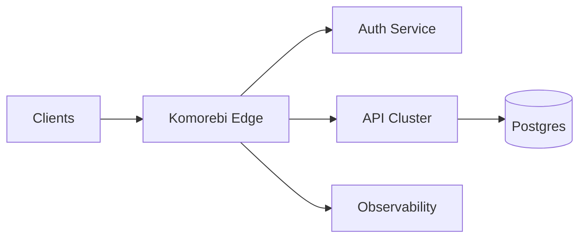
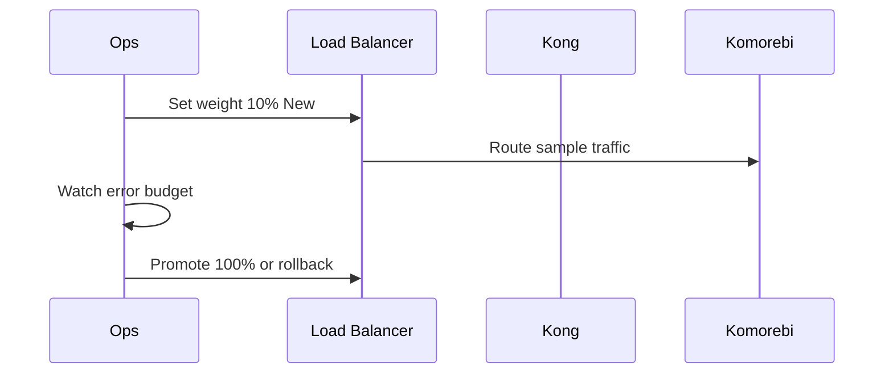

# AIRP Block Capability Showcase

Fictional Komorebi Gateway migration report — zh / ja / en

**Kind:** generic · **Authors:** AIRP Sample Generator · **Tags:** sample, showcase, blocks, i18n, demo

---

- **Block types**: 46 kinds — Full schema discriminator coverage
- **Locales**: 3 — zh-CN · ja · en
- **Migration window**: 4h
- **API coverage**: 98%
- _Sample report_
- _Fictional data_

> This artifact demonstrates **AIRP v1.0.0**: a fictional **Komorebi Gateway** edge migration narrative wiring every block type in one report for `/airp-html` and Dashboard preview. Content is illustrative only.



- **Edge** — Rust L7 gateway replacing Kong plugin chains.
- **Auth** — JWT + mTLS with legacy IdP compatibility shim.

## Prose and layout blocks

> Headings, paragraphs, quotes, and callouts.

### Level-3 heading sample

Paragraphs support **bold**, `inline code`, and [links](https://example.com), or structured inline nodes.

Structured RichText: **strong node** + `code node` + [link node](https://airp.dev)

> The protocol is the document; the document is validatable IR.
>
> — — Fictional architect Yuki

> > Migration replaces **assumptions**, not just software: latency, blast radius, and observability contracts all shift.

> **Tip**

`callout` supports five variants: info, tip, success, warning, danger.

- Bullet item A
- Bullet item B with `code`

1. Step 1: Generate `.airp.json`
2. Step 2: Run `validate-airp` until OK
3. Step 3: Render with `/airp-html`

- [x] Schema validation passed
- [ ] Canary traffic 10% — Target 2026-06-05
- [ ] Rollback drill

**IR**:
Semantic document without layout coordinates.

**SSOT**:
Single source of truth: `airp-document.schema.json`.


---

_Structured data_

## Tables, comparison, and collections

_Regional latency (fictional ms)_

| Region | Before | After | Status |
| --- | --- | --- | --- |
| ap-northeast-1 | 42 | 28 | pass |
| eu-west-1 | 55 | 31 | pass |
| us-east-1 | 38 | 45 | warning |

| Region | Before | After | Status |
| --- | --- | --- | --- |
| Global P95 | 52 | 35 | partial |

### Kong plugins

Serial Lua plugins; hard to debug.

### Komorebi native policy

Rust middleware + declarative routes; unit-testable.

### Key metrics

- **RPS**: 125000 req/s
- **Error rate**: 0.02%

### card

- **Module A** — Card variant density.
- **Module B** — Auth middleware layer.
- **Module C** — Observability and metrics export.

### chip / compact

- **JWT**: on
- **WAF**: on
- **Rate Limit**: 500/s
- **CORS**: strict


- **Build**: #4821
- **Deploy**: v2.4.1
- **Rollback**: v2.3.8

### panel + stat

- **Availability**: 99.95%
- **P95 latency**: 35 ms
- **Error rate**: 0.02%

- **Health check** — Panels may nest other blocks.
- **Config hot reload** — Apply without restart.

### metric

#### Traffic overview

- **RPS**: 125000 req/s
- **Concurrent connections**: 8420 conn
- **Bandwidth**: 3.2 Gbps

| Key | Value |
| --- | --- |
| Owner | Team Edge / 佐藤 (虚构) |
| Environment | `staging` → `production` |

| Item | Status | Detail |
| --- | --- | --- |
| Schema validation | pass | validate-airp prints OK |
| Integration tests | partial | 2 flaky cases quarantined |
| Compliance scan | fail | 1 high CVE awaiting patch |

## Code, files, and diagrams

```rust
pub fn apply_rate_limit(ctx: &mut Context) -> Result<()> {
    let key = ctx.client_id();
    limiter.check(key, 1000)?;
    Ok(())
}
```

```yaml
--- a/config/routes.yaml
+++ b/config/routes.yaml
-upstream: kong-cluster
-plugins:
-  - rate-limiting
+upstream: komorebi-edge
+policies:
+  - native-rate-limit
```

```text
komorebi/
  edge/ (New gateway core)
    Cargo.toml
  legacy/kong/ (Retired)
```

| Path | Change | Note |
| --- | --- | --- |
| edge/src/main.rs | added | Entry and listener bind |
| deploy/kong.yml | deleted |  |
| docs/runbook.md | modified |  |

Canary cutover sequence



1. **Shadow traffic** (done)
  Mirror requests to Komorebi without client response.
2. **Canary** (in_progress)
  10% production traffic.
3. **Full cutover** (pending)

## Governance blocks

### Decision and risk group

#### Implement Edge in Rust over Go

_Status: accepted_

Team Rust experience; need minimal tail latency.

**Chosen:** Rust

P99 budget 30ms; Go missed SLO under load test.

- **Rust**
  - Pros: No GC pauses
  - Cons: Longer compile times
- **Go**
  - Pros: Easier hiring
  - Cons: Tail latency variance

#### Dual-stack config drift

_Severity: high_ · _Status: open_

During parallel operation, route tables may diverge.

**Mitigation:** Single GitOps repo with CI diff gate.

- [ ] Assumption: all northbound APIs are REST/JSON; no gRPC passthrough.

- Production change window: Tue 02:00–06:00 UTC (hard). _(non-negotiable)_

- Decommission Kong admin API entirely in Q3? _(blocking)_

## Planning, requirements, and tests

- 2026-05-20: **Shadow traffic on** (done)
  Observe only; no user impact.
- 2026-06-04: **Sample report generated** (done)
- 2026-06-10: **Planned full cutover** (pending)

#### Phase 1 — Foundation (2026 Q2)

_Status: done_

- Edge MVP and shadow traffic

#### Phase 2 — Production (2026 Q3)

_Status: in_progress_

- Canary → full; retire Kong

| ID | Summary | Status | Evidence |
| --- | --- | --- | --- |
| REQ-EDGE-01 | P99 latency < 30ms | pass | Load test report #882 (fictional) |
| REQ-EDGE-02 | Hot-reload WAF rules | partial |  |

- **unit-edge**: 412 passed, 0 failed, skipped 3
- **integration-gateway**: 89 passed, 2 failed, skipped 1
  2 failures tied to legacy Kong route cache

| Method | Path | Summary | Status |
| --- | --- | --- | --- |
| GET | /health | Health check | pass |
| POST | /v1/routes | Declarative route registration | in_progress |
| DELETE | /v1/routes/{id} | Route deletion | pending |

## References, media, and composition

### Related links

- [JSON Schema](https://json-schema.org/) — Foundation for AIRP structural validation
- [Mermaid](https://mermaid.js.org/) — Diagram block rendering source

- **Komorebi**: Fictional edge gateway product name in this sample.
- **Canary**: Route a small share of real traffic to the new version.

- [cite-1] Internal Design Doc v3.2 (fictional) (§4.2 Rate limiting)
- [cite-2] SRE Runbook — Edge Migration (page 12)


_Fictional UI screenshot (placeholder)_

[Embed sample (replace with real demo)](https://www.youtube.com/watch?v=dQw4w9WgXcQ)

<details>
<summary>Expand: long code samples</summary>

```typescript
import { readFileSync } from 'node:fs';
import { validateAirpDocument } from './airp-schema';

const raw = readFileSync('.docs/airp/sample.airp.json', 'utf8');
const doc = JSON.parse(raw);
const result = validateAirpDocument(doc);
if (!result.ok) throw new Error(result.message);
console.log('OK');
```

```diff
@@ -1,3 +1,3 @@
-upstream: kong
+upstream: komorebi
 rate_limit: 1000
```

</details>

> **Success**

If you see this, `callout` variant=success rendered.

> Warning callout without title.

> **Danger**

Never put production secrets in `.airp.json`.


## Appendix A — Block type index

This sample covers all 46 block types listed in the prose above.
