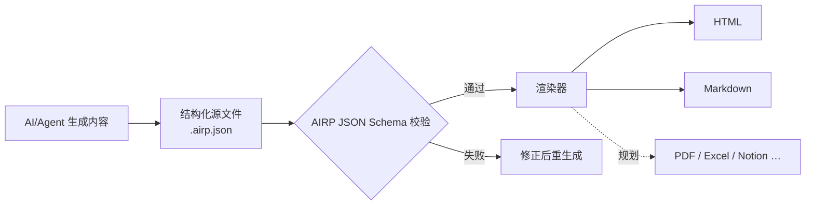

# AIRP — AI Report Protocol（AI 报告协议）

[🇺🇸 English](./README.md) | [🇨🇳 中文](./README.cn.md) | [🇯🇵 日本語](./README.ja.md) | [🇰🇷 한국어](./README.ko.md) | [🇩🇪 Deutsch](./README.de.md) | [🇫🇷 Français](./README.fr.md) | [🇷🇺 Русский](./README.ru.md) | [🇪🇸 Español](./README.es.md) | [🇧🇷 Português (Brasil)](./README.pt-BR.md) | [🇮🇹 Italiano](./README.it.md)


**把 AI/Agent 的对话输出，变成可校验、可渲染、可长期维护的结构化报告。**

在 Cursor、Copilot、Claude Code 等环境里写方案、复盘或审计材料时，聊天记录往往难以直接交付：版式不稳、难检索、也不方便换语言或换格式再发一遍。AIRP 用统一的 **JSON Schema** 约束报告结构（类似 Notion 的多种 **Block** 内容块组成），先产出结构化源文件 **`.airp.json`**，再通过 **渲染器** 导出 **HTML**（阅读/演示）或 **Markdown**（文档流/二次编辑）。

仓库地址：`https://github.com/maosong-ai/airp`

## 适合谁用

| 角色 | 典型报告 |
|---|---|
| 项目经理 / 产品 | 立项说明、里程碑复盘、风险与待办 |
| 运营 / 商务 | 活动总结、对标分析、决策与跟进项 |
| 内审 / 质控 | 问题分级、证据链、整改与验证清单 |
| 研发 / 架构 | 迁移方案、技术评审、测试与变更说明 |

## 核心能力一览

| 能力 | 说明 |
|---|---|
| **结构化源文件** | `.airp.json` 按 Schema 组织内容；生成后自动校验，减少「看起来完整、实际缺段」的情况 |
| **内容与呈现分离** | 正文只维护源文件；HTML / Markdown 由渲染器导出，换版式不必重写正文 |
| **多语言（i18n）** | 同一份源文件可携带多语言文案（`i18n.locales`）；导出或浏览时选择语言；界面支持中、英、日、韩、德、法、俄、西、葡、意等 |
| **主题与版式** | HTML 导出可切换明暗主题等外观，**不改正文** |
| **可扩展** | 后续可接入 PDF、Excel、Notion 等导出方式 |

## 快速开始

**1. 安装 Skill**

```bash
npx skills add maosong-ai/airp
```

**2. 命令与产出物**

| 命令 | 产出物 | 用途 |
|---|---|---|
| `/airp` | `*.airp.json` | 生成并校验结构化源文件（存档、检索、二次加工、再导出） |
| `/airp-dashboard` | 本地 Dashboard | 浏览器中预览源文件，可也以在线导出 HTML / Markdown 等 |
| `/airp-html` | `*.html` | 将已有源文件渲染为单文件网页，便于分享与演示 |
| `/airp-markdown` | `*.md` | 按指定语言（locale）导出 Markdown，便于语雀/飞书/GitHub 等 |

**3. 推荐链路**

```
/airp  →  源文件  →  /airp-html      →  HTML      # 对外阅读、演示
/airp  →  源文件  →  /airp-markdown  →  Markdown  # 文档库、继续编辑
```

**4. 输出目录**

默认：项目内 `.docs/airp/`；可用 `--out <dir>` 指定路径。

## 工作流程



## 为什么需要「源文件 + 渲染」

AIRP 的 **JSON Schema**（`airp-document.schema.json`）是生成与校验的**唯一规范（SSOT）**：

- **可验证**：字段与章节有约束，校验失败即视为未完成，避免伪交付。
- **可复用**：源文件适合版本对比、检索与自动化；HTML / Markdown 面向人读。
- **对 AI 更稳、更省上下文**：Block 结构边界清晰，长报告比自由撰写 HTML 更不易跑偏，同等信息量通常比冗长 HTML 更紧凑。
- **多格式不重复劳动**：改源文件一次，按需导出网页或文档。

报告正文由多种 **Block**（如章节 `section`、表格 `table`、风险 `risk`、流程图 `mermaid` 等）拼装而成。完整类型列表见 Schema；日常只需说明报告类型（如「审计报告」「项目复盘」），由 `/airp` 自动选用合适块组合。

### 内容模块（按用途归类）

| 类别 | 典型 Block |
|---|---|
| 开篇与摘要 | `hero`、`lead`、`pullQuote` |
| 正文与版式 | `section`、`paragraph`、`table`、`callout`、各类列表 |
| 流程与图示 | `flowSteps`、`mermaid`、`timeline`、`roadmap` |
| 决策与风险 | `comparison`、`decision`、`risk`、`assumption`、`openQuestion` |
| 执行与验证 | `checklist`、`statusBoard`、`testResult`、`requirementTrace` |
| 附录与参考 | `collapsible`、`tabs`、`appendix`、`glossary`、`citation` |

## 常见问题

### 应该保留哪个文件？

| 目的 | 建议保留 |
|---|---|
| 团队存档、机器处理、后续再导出 | `.airp.json`（源文件） |
| 邮件/IM 分享、演示阅读 | `.html` |
| 文档库编辑、对接 Markdown 工具链 | `.md`（`/airp-markdown` + locale） |

### 多语言怎么用？

- 在提示里写明需要的语言（如「/airp <提示词> 生成中日英三语」）→ 源文件包含三语文案。  
- 未说明时（如「/airp <提示词>」） → Skill 按**当前对话语言**生成单语言源文件。

### AIRP vs HTML vs Markdown

三者不是互斥关系：**HTML / Markdown 是面向阅读的导出形态。**

| 对比项 | AIRP（`.airp.json`） | 直接让 AI 写 HTML | 直接让 AI 写 Markdown |
|---|---|---|---|
| **角色** | 结构化源文件 + Schema 校验 | 成品展示页 | 成品文档 |
| **结构约束** | Block + Schema，生成后可校验 | 依赖 Prompt，长页易漏块、版式漂移 | 依赖写作习惯，长文层次易不一致 |
| **多语言** | 多语言文案结构 | 常需另存整页或手工复制 | 常需多份 `.md` |
| **多格式导出** | 同一源文件 → HTML / Markdown（及后续PDF/Excel等格式） | 转 Markdown 需重写或有损转换 | 转 HTML 需重写或补样式 |
| **人工阅读** | 通过 `/airp-html` 或 `/airp-markdown` 渲染 | 单文件打开即看，版式完整 | 平台渲染即可，纯文本感强 |
| **二次编辑** | AI直接改源文件；也可导出 Markdown 局部改 | 改 HTML 成本高 | 在文档工具中最自然 |
| **存档 / 检索 / diff** | 结构化，字段稳定 | 标签与样式混杂，语义难抽取 | 文本友好，字段不统一 |
| **AI 多轮修改** | 改 Block 字段，边界清晰 | 标签多、文件长，易漏改 | 中等；结构靠自觉维持 |
| **Token / 上下文** | 模块化 JSON，冗余少 | 同样内容体积大，占用高 | 中等 |
| **版式与主题** | 渲染层切换，源文件不变 | 样式嵌在文件中 | 取决于目标平台 |
| **更适合** | 正式报告、多语言、多轮迭代、团队统一模板 | 一次性单页、强展示 | 短文、笔记、终稿即 Markdown |
| **不太适合** | 两三句话、无需存档 | 要强校验、多语言、多格式流水线 | 要强 Schema、一键多语言导出 |

> **结论**：需要「一致性 + 可检查的结构 + 一种内容多种导出」时用 AIRP；已有明确终稿格式且只出一版时，直接 HTML 或 Markdown 即可。

## 后续计划

- 源文件与导出物的加密能力
- 多 Sheet 页导出
- PDF、Excel、Notion 等渲染器

---

## 许可

MIT
