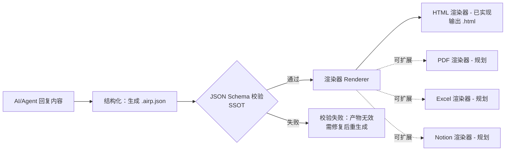

# AIRP — AI Report Protocol

[🇺🇸 English](./README.md) | [🇨🇳 中文](./README.cn.md) | [🇯🇵 日本語](./README.ja.md)


让 AI/Agent 输出的技术报告变成**可校验、可渲染、可归档**的“产品级交付物”。

AIRP 用一个稳定的 **JSON Schema（唯一真源）** 来约束报告结构（blocks），并提供配套的 **Dashboard** 与 **静态 HTML 渲染**能力，把“聊天里的内容”变成可复用、可分享的报告文件（`.airp.json` / `.html`）。

此外，AIRP 在“内容（schema）”与“呈现（renderer）”之间做了解耦，使得：

- **渲染器可扩展**：在不改变 schema 的前提下，未来可扩展输出到 PDF / Excel / Notion 等载体
- **多语言（中/日/英）**：同一份报告可携带多语言文案，渲染器按选择的 locale 输出
- **皮肤/主题**：在不改内容的前提下切换样式皮肤（明/暗色、品牌色、排版密度等）

仓库地址：`https://github.com/maosong-ai/airp`

## 适用场景

- **重构/迁移报告**：范围、影响面、变更清单、回滚策略、风险与验证
- **审计/诊断报告**：问题分级、证据链、修复建议、行动项追踪
- **技术方案/评审记录**：决策、权衡、假设、里程碑与验收标准

## 工作原理（从 AI 到可交付报告）

AIRP 把“AI 回复的内容”变成可校验的结构化数据，再交给渲染器输出为面向阅读/分享的产物（目前提供 HTML，未来可扩展更多渲染器）。



## 快速开始（安装 skill）

安装示例：

```bash
npx skills add maosong-ai/airp
```

命令一览：

| 命令 | 产出物 | 用途 |
|---|---|---|
| `/airp` | `*.airp.json` | 结构化、可机器校验的报告（适合存档/索引/二次加工） |
| `/airp-html` | `*.html`（单文件） | 把已有的 `*.airp.json` 渲染成可分享/可阅读的单文件 HTML |
| `/airp-dashboard` | 本地 Dashboard（浏览器打开） | 上传/浏览/渲染 `.airp.json`，用于交互式查看 |

## 核心原则：Schema 是唯一真源（SSOT）

AIRP 的 **JSON Schema** 是生成与校验的唯一真源：`./airp-document.schema.json`

- **可验证**：把“看起来像对的自然语言”变成“要么符合约束、要么失败”的结构化产物，避免伪成功。
- **可渲染/可扩展**：内容用稳定 schema 表达，渲染层只关心如何呈现；新增 PDF/Excel/Notion 等渲染器不需要改内容生产逻辑。
- **可归档/可索引/可对比**：`*.airp.json` 作为源文件，便于检索、聚合统计、差异对比与自动化处理（比纯 HTML/Markdown 更适合机器消费）。
- **对 AI/Agent 更友好且更省 Token**：JSON 结构明确、边界清晰，AI 更容易稳定地读写与遵循约束；结构化字段复用减少冗余叙述与重复上下文，同等信息密度下通常比长篇 Markdown/HTML 更短、更易被后续步骤复用。
- **可演进但不失控**：schema 明确 required/可选字段与 `additionalProperties: false`，让格式演进有边界、兼容性可控。

## 支持的 Block（类型一览）

> 以 schema 中 `blocks[].type` 的 `const` 为准（区分大小写）。

| Block（type） | 用途 |
|---|---|
| `hero` | 报告头部关键指标（metric cards），用于开场摘要与数字化结论 |
| `section` | 章节容器（可嵌套 blocks），用于组织目录与大纲结构 |
| `group` | 分组容器（可嵌套 blocks），用于把相关内容组合成一块 |
| `divider` | 分割线，用于视觉分隔内容块 |
| `spacer` | 留白间距，用于控制版式节奏 |
| `heading` | 标题（非容器），用于小节标题/层级标题 |
| `paragraph` | 段落正文（Markdown），用于通用说明与叙述 |
| `lead` | 引导段/摘要段，用于在章节开头快速说明重点 |
| `pullQuote` | 强调引述，用于突出一句关键结论/观点 |
| `blockquote` | 引用块，用于引用外部材料或原话证据 |
| `callout` | 提示/警告/成功等醒目提示块，用于强调风险、注意事项与结论 |
| `bulletList` | 无序列表，用于要点罗列 |
| `numberedList` | 有序列表，用于步骤与流程 |
| `checklist` | 勾选清单，用于验证项/待办项/验收项 |
| `definitionList` | 定义列表（术语-解释），用于概念解释与规范说明 |
| `table` | 表格，用于结构化展示对照数据/清单 |
| `comparison` | 对比块，用于“方案 A vs 方案 B”这类并排对比（可嵌套 blocks） |
| `collection` | 卡片集合/面板集合，用于把多个条目以卡片方式归类展示（条目可嵌套 blocks） |
| `keyValueList` | 键值列表，用于参数、配置、摘要字段列表 |
| `statusBoard` | 状态看板，用于任务/模块状态汇总与进度追踪 |
| `code` | 代码块，用于粘贴代码、命令、日志片段 |
| `codeDiff` | 代码 Diff，用于展示变更前后差异 |
| `fileTree` | 文件树，用于展示目录结构/模块结构 |
| `fileChangeList` | 文件变更清单，用于列出改动文件与说明 |
| `mermaid` | Mermaid 图，用于流程/时序/架构等图表 |
| `architectureOverview` | 架构总览（包含 Mermaid + 说明），用于结构化呈现架构与组件关系 |
| `flowSteps` | 流程步骤块，用于把流程拆成步骤卡片/步骤说明 |
| `decision` | 决策记录，用于记录决策、备选项与取舍原因 |
| `risk` | 风险项，用于风险描述、等级、缓解与验证 |
| `assumption` | 假设项，用于记录前提假设与验证方式 |
| `constraint` | 约束项，用于记录技术/业务/资源限制条件 |
| `openQuestion` | 开放问题，用于记录待确认事项与后续跟进 |
| `timeline` | 时间线，用于按时间顺序呈现事件/里程碑 |
| `roadmap` | 路线图，用于阶段规划、里程碑与交付节奏 |
| `requirementTrace` | 需求追踪，用于需求-实现-测试的可追溯链路 |
| `testResult` | 测试结果，用于汇总测试项、结果与证据 |
| `apiInventory` | API 清单，用于列出接口、用途、风险与变更点 |
| `linkList` | 链接列表，用于汇总相关资料/PR/文档入口 |
| `glossary` | 术语表，用于统一术语与缩写解释 |
| `citation` | 引用/参考文献，用于证据链与来源标注 |
| `image` | 图片，用于截图、图示与证据补充 |
| `embed` | 嵌入内容，用于嵌入外部资源（如 iframe/可视化链接等） |
| `collapsible` | 折叠块（可嵌套 blocks），用于收纳细节/长内容 |
| `tabs` | 选项卡（可嵌套 blocks），用于在同一位置切换多组内容 |
| `appendix` | 附录（可嵌套 blocks），用于收纳补充材料 |
| `agentNote` | Agent 备注，用于记录生成过程中的补充说明/偏好/提示信息（面向作者/审阅者） |

## 后续计划

- **产物密码加密**：支持对 `*.airp.json` / `*.html` 等交付物进行加密与解密，提升分发与存档安全性。
- **多页文档生成**：支持将单份报告拆分为多页/多章节输出，便于长文档阅读、打印与按模块交付。
- **多种格式渲染**：在保持 schema 稳定（SSOT）的前提下，扩展更多渲染器（PDF / Excel / Notion 等）。

## 常见问题

### 产物会输出到哪里？

- 默认输出到项目内：`.docs/airp/`
- 可通过命令参数 `--out <dir>`

### 我应该保存哪一个文件？

- **需要归档/二次加工**：保存 `*.airp.json`（结构化源文件）
- **需要分享/阅读**：保存 `*.html`（单文件报告）

> 提示：推荐链式使用：先 `/airp` 生成 `*.airp.json`，再 `/airp-html` 渲染成 `*.html`。
> 例如："/airp /airp-html xxxxxx"

---

## 许可

MIT

