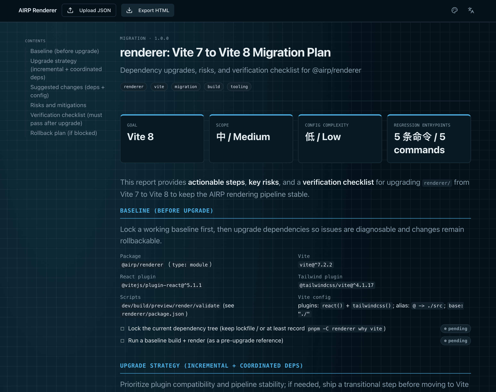

# AIRP — AI Report Protocol（AI 报告协议）

[🇺🇸 English](./README.md) | [🇨🇳 中文](./README.cn.md) | [🇯🇵 日本語](./README.ja.md) | [🇰🇷 한국어](./README.ko.md) | [🇩🇪 Deutsch](./README.de.md) | [🇫🇷 Français](./README.fr.md) | [🇷🇺 Русский](./README.ru.md) | [🇪🇸 Español](./README.es.md) | [🇧🇷 Português (Brasil)](./README.pt-BR.md) | [🇮🇹 Italiano](./README.it.md)



**让 AI 写出来的报告更好读，也好改。**
1
AI 直接出 Markdown，往往又平又散；直接出 HTML，版式好看，但又长又费 token，后面也不好改。AIRP 的做法是：先让 AI 写出一份 `*.airp.json` 源文件，再用 **AIRP Renderer** 扩展打开成排版好的 HTML；需要对外发时，再导出 HTML 或 Markdown。

源文件按 Notion 那套 **积木块（Block）** 组织，目前有 **46** 种——指标首屏、对比、决策、时间线、Mermaid、架构总览等。每种有自己的版式，方案、评审、复盘、审计这类报告会清楚很多，不会糊成一坨字。

## 报告是怎么跑起来的

写和读是分开的。中间那份 `*.airp.json` 由 JSON Schema 约束，生成和校验都以它为准：

| 谁 | 干什么 |
| --- | --- |
| **`/airp` Skill** | 让 AI 生成或改源文件，并做校验 |
| **VS Code 扩展** | 在编辑器里阅读；导出 HTML / Markdown |

这样做的实际好处：

- 缺字段、缺章节时校验会失败，少交半成品。
- 源文件适合进 Git、做 diff；HTML / Markdown 只当给人看的成品。
- 积木块边界清楚，对模型更稳，通常也比整页手写 HTML 更省 token。

## 快速开始

### 1. 安装 VS Code 扩展

到 [Marketplace](https://marketplace.visualstudio.com/items?itemName=airp.airp-renderer-vscode) 安装 **AIRP Renderer**（扩展 ID：`airp.airp-renderer-vscode`）。

打开任意 `*.airp.json` 就能读，也可以导出 HTML / Markdown。需要 VS Code 兼容编辑器（如：Cursor）。

### 2. 安装 `/airp` Skill

只读别人已经写好的源文件，装扩展就够了。要让 AI 帮你写新报告时，再装 Skill：

```bash
npx skills add maosong-ai/airp
```

对话里输入 `/airp <主题>`，Skill 会生成并校验源文件（默认目录：`.docs/airp/`），再用扩展打开即可阅读。可选参数：`--locale zh-CN`、`--out <目录>`。

## 多语言

支持这些文档语言：English（`en-US`）、简体中文（`zh-CN`）、日本語（`ja-JP`）、한국어（`ko-KR`）、Deutsch（`de-DE`）、Français（`fr-FR`）、Русский（`ru-RU`）、Español（`es-ES`）、Português Brasil（`pt-BR`）、Italiano（`it-IT`）。写报告时用 `/airp --locale …` 指定。

## 积木块

不用记这些积木块，`/airp` Skill 会按内容自己选；想定制时再对照下面的表。

| 版式与正文 | 对照与清单 | 工程与决策 |
| --- | --- | --- |
| **指标首屏**(`hero`)<br>*开篇放最关键的几项指标* | **表格**(`table`)<br>*多行多列对齐对照* | **代码**(`code`)<br>*放一段短代码* |
| **导语**(`lead`)<br>*用一句话点明本节要讲什么* | **对比**(`comparison`)<br>*左右两栏看改前改后* | **代码差异**(`codeDiff`)<br>*标出改了哪些行* |
| **章节**(`section`)<br>*按主题分成可跳转的大段* | **卡片集**(`collection`)<br>*用卡片铺开一组条目* | **文件树**(`fileTree`)<br>*展示目录结构* |
| **标题**(`heading`)<br>*标出小节层级* | **键值列表**(`keyValueList`)<br>*成对列出名称和取值* | **文件变更**(`fileChangeList`)<br>*列出新增、修改、删除的文件* |
| **段落**(`paragraph`)<br>*写一段说明文字* | **定义列表**(`definitionList`)<br>*术语和释义成对列出* | **Mermaid**(`mermaid`)<br>*画流程、时序、状态等图* |
| **分组**(`group`)<br>*把相邻内容收成一组* | **术语表**(`glossary`)<br>*集中解释文中用词* | **架构总览**(`architectureOverview`)<br>*总图加模块卡片看系统* |
| **醒目引文**(`pullQuote`)<br>*把一句关键结论单独拎出来* | **状态板**(`statusBoard`)<br>*一眼看过、不过或部分通过* | **接口清单**(`apiInventory`)<br>*列出接口及其用途* |
| **引用**(`blockquote`)<br>*引用一段原文或他人说法* | **检查清单**(`checklist`)<br>*勾选事项是否完成* | **测试结果**(`testResult`)<br>*汇总用例通过与失败数* |
| **提示**(`callout`)<br>*标出注意、警告或结论* | **时间线**(`timeline`)<br>*按时间排出发生过的事* | **需求追溯**(`requirementTrace`)<br>*把需求对到状态和证据* |
| **无序列表**(`bulletList`)<br>*并列列出若干要点* | **路线图**(`roadmap`)<br>*按阶段排出目标和进度* | **决策**(`decision`)<br>*记下选了什么、为什么* |
| **有序列表**(`numberedList`)<br>*按顺序写步骤或条目* | **步骤流**(`flowSteps`)<br>*把流程拆成先后步骤* | **风险**(`risk`)<br>*写出风险和处理现状* |
| **分隔线**(`divider`)<br>*在上下内容之间划开* | **链接列表**(`linkList`)<br>*列出相关链接* | **假设**(`assumption`)<br>*写明当前依赖的前提* |
| **留白**(`spacer`)<br>*在块与块之间留出空隙* | **出处**(`citation`)<br>*标明引用的来源* | **约束**(`constraint`)<br>*标出不能突破的限制* |
| **图片**(`image`)<br>*插入一张图并配说明* | **分页签**(`tabs`)<br>*同一处切换多种看法* | **待决问题**(`openQuestion`)<br>*记下还没定的问题* |
| **外链嵌入**(`embed`)<br>*嵌一段外部页面或资源* | **折叠**(`collapsible`)<br>*把次要的长内容收起来* | **代理备注**(`agentNote`)<br>*留给模型看的备注，默认不展示给人* |
| **附录**(`appendix`)<br>*把补充材料放到文末* | | |

## 接下来打算做什么

现在已经能用：Skill 生成 / 校验源文件，扩展阅读并导出 HTML / Markdown。后面计划：

| 方向 | 说明 |
| --- | --- |
| **可视化编辑** | 在扩展里直接改内容，不必事事找 Skill |
| **更多导出格式** | 增加 PDF（打印、归档） |
| **多页 / 多 Sheet** | 长报告按章节或工作表拆开，别堆成一页 |

## 本地开发与构建

给参与开发的人看的。平时只用 VS Code 扩展和 Skill即可，不用克隆这个仓库。

环境：Node.js **20.19+**、pnpm **10.17+**。

```bash
pnpm install
```

**校验 CLI**（`airp-validate`）

```bash
// 调试
pnpm validate-cli:sample

// 编译产物：`apps/validate-cli/dist/cli.mjs`
pnpm exec turbo run build --filter=@airp/validate-cli
```

**渲染 CLI**（`airp-render`）

```bash
// 调试
pnpm renderer-cli:sample

// 编译产物：`apps/renderer-cli/dist/cli.mjs`
pnpm exec turbo run build --filter=@airp/renderer-cli
```

**VS Code 扩展**

用 VS Code 打开本仓库，按 F5（或运行 **Launch AIRP Renderer**）进入 Extension Development Host 即可调试。

```bash
// 编译
pnpm exec turbo run build --filter=airp-renderer-vscode

// 打包产物：`apps/renderer-vscode/dist/airp-renderer-vscode-<version>.vsix`
pnpm --filter=airp-renderer-vscode package
```

---

## 变更记录

[变更记录](https://github.com/maosong-ai/airp/blob/main/CHANGELOG.md)

## 许可证

MIT

[AIRP](https://github.com/maosong-ai/airp) | Copyright (c) 2026 毛松 <maosong-life@outlook.com>
