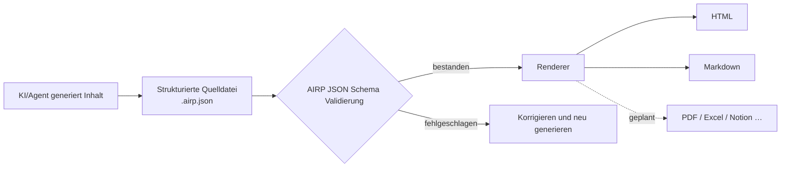

# AIRP — AI Report Protocol (KI-Berichtsprotokoll)

[🇺🇸 English](./README.md) | [🇨🇳 中文](./README.cn.md) | [🇯🇵 日本語](./README.ja.md) | [🇰🇷 한국어](./README.ko.md) | [🇩🇪 Deutsch](./README.de.md) | [🇫🇷 Français](./README.fr.md) | [🇷🇺 Русский](./README.ru.md) | [🇪🇸 Español](./README.es.md) | [🇧🇷 Português (Brasil)](./README.pt-BR.md) | [🇮🇹 Italiano](./README.it.md)


**Verwandeln Sie die Ausgaben von KI/Agenten in strukturierte Berichte, die validierbar, renderbar und langfristig wartbar sind.**

Beim Erstellen von Konzepten, Retrospektiven oder Audit-Unterlagen in Cursor, Copilot, Claude Code und ähnlichen Umgebungen lassen sich Chat-Verläufe selten direkt ausliefern: Das Layout ist instabil, die Suche schwierig, und ein erneutes Exportieren in anderer Sprache oder einem anderen Format ist mühsam. AIRP nutzt ein einheitliches **JSON Schema**, um die Berichtsstruktur zu definieren (ähnlich wie bei Notion aus mehreren **Block**-Inhaltstypen), erzeugt zuerst eine strukturierte Quelldatei **`.airp.json`** und exportiert anschließend über einen **Renderer** **HTML** (Lesen/Präsentation) oder **Markdown** (Dokumentations-Workflows / Weiterbearbeitung).

Repository: `https://github.com/maosong-ai/airp`

## Für wen ist es gedacht

| Rolle | Typische Berichte |
|---|---|
| Projektmanager / Produkt | Projektbeschreibungen, Meilenstein-Retrospektiven, Risiken und To-dos |
| Operations / Business | Kampagnenzusammenfassungen, Benchmark-Analysen, Entscheidungen und Follow-ups |
| Interne Revision / Qualitätssicherung | Schweregrade, Evidenzketten, Korrektur- und Verifikations-Checklisten |
| Entwicklung / Architektur | Migrationspläne, technische Reviews, Test- und Änderungsbeschreibungen |

## Kernfunktionen im Überblick

| Funktion | Beschreibung |
|---|---|
| **Strukturierte Quelldateien** | `.airp.json` organisiert Inhalte gemäß Schema; automatische Validierung nach der Generierung reduziert Fälle, in denen ein Bericht „vollständig wirkt, aber Abschnitte fehlen“ |
| **Trennung von Inhalt und Darstellung** | Nur die Quelldatei pflegen; HTML / Markdown werden vom Renderer exportiert—Layout ändern, ohne den Inhalt neu zu schreiben |
| **Mehrsprachigkeit (i18n)** | Eine Quelldatei kann Texte in mehreren Sprachen tragen (`i18n.locales`); Sprache beim Export oder beim Durchsuchen wählen; die Oberfläche unterstützt u. a. Chinesisch, Englisch, Japanisch, Koreanisch, Deutsch, Französisch, Russisch, Spanisch, Portugiesisch und Italienisch |
| **Themes und Layout** | Beim HTML-Export lassen sich Hell-/Dunkel-Themes und andere Erscheinungsoptionen umschalten, **ohne den Inhalt zu ändern** |
| **Erweiterbar** | Künftig u. a. PDF, Excel, Notion und weitere Exportziele |

## Schnellstart

**1. Skill installieren**

```bash
npx skills add maosong-ai/airp
```

**2. Befehle und Ausgaben**

| Befehl | Ausgabe | Zweck |
|---|---|---|
| `/airp` | `*.airp.json` | Strukturierte Quelldatei generieren und validieren (Archiv, Suche, Nachbearbeitung, Re-Export) |
| `/airp-dashboard` | Lokales Dashboard | Quelldatei im Browser vorschauen; HTML / Markdown u. a. auch online exportieren |
| `/airp-html` | `*.html` | Vorhandene Quelldatei als Einzeldatei-Webseite rendern—zum Teilen und Präsentieren |
| `/airp-markdown` | `*.md` | Markdown für ein gewähltes Locale exportieren—z. B. für Yuque, Feishu, GitHub |

**3. Empfohlener Ablauf**

```
/airp  →  Quelldatei  →  /airp-html      →  HTML      # externes Lesen, Präsentation
/airp  →  Quelldatei  →  /airp-markdown  →  Markdown  # Dokumentation, Weiterbearbeitung
```

**4. Ausgabeverzeichnis**

Standard: `.docs/airp/` im Projekt; mit `--out <dir>` ein anderes Verzeichnis angeben.

## Workflow



## Warum „Quelldatei + Renderer“

Das **JSON Schema** von AIRP (`airp-document.schema.json`) ist die **Single Source of Truth (SSOT)** für Generierung und Validierung:

- **Validierbar**: Felder und Abschnitte sind eingeschränkt; bei Validierungsfehlern gilt der Bericht als unvollständig—keine Schein-Lieferungen.
- **Wiederverwendbar**: Quelldateien eignen sich für Versionsvergleich, Suche und Automatisierung; HTML / Markdown sind für menschliches Lesen gedacht.
- **Stabiler und kontextsparender für KI**: Klare Block-Grenzen; bei langen Berichten driftet die Struktur seltener ab als bei frei geschriebenem HTML, und bei gleicher Informationsdichte ist der Umfang meist kompakter.
- **Mehrere Formate ohne Doppelarbeit**: Quelldatei einmal anpassen, Web oder Dokumente bei Bedarf exportieren.

Der Berichtskörper wird aus verschiedenen **Blocks** zusammengesetzt (z. B. Abschnitt `section`, Tabelle `table`, Risiko `risk`, Diagramm `mermaid` usw.). Die vollständige Typenliste steht im Schema; im Alltag reicht es, den Berichtstyp zu nennen (z. B. „Audit-Bericht“, „Projekt-Retrospektive“)—`/airp` wählt passende Block-Kombinationen.

### Inhaltsmodule (nach Zweck)

| Kategorie | Typische Blocks |
|---|---|
| Einleitung und Zusammenfassung | `hero`, `lead`, `pullQuote` |
| Fließtext und Layout | `section`, `paragraph`, `table`, `callout`, verschiedene Listen |
| Ablauf und Diagramme | `flowSteps`, `mermaid`, `timeline`, `roadmap` |
| Entscheidungen und Risiken | `comparison`, `decision`, `risk`, `assumption`, `openQuestion` |
| Ausführung und Verifikation | `checklist`, `statusBoard`, `testResult`, `requirementTrace` |
| Anhang und Referenzen | `collapsible`, `tabs`, `appendix`, `glossary`, `citation` |

## Häufige Fragen

### Welche Datei soll ich behalten?

| Ziel | Empfehlung |
|---|---|
| Team-Archiv, maschinelle Verarbeitung, späterer Re-Export | `.airp.json` (Quelldatei) |
| Teilen per E-Mail/IM, Präsentation zum Lesen | `.html` |
| Bearbeitung in der Dokumentation, Anbindung an Markdown-Toolchains | `.md` (`/airp-markdown` + Locale) |

### Wie funktioniert Mehrsprachigkeit?

- Sprachen im Prompt angeben (z. B. „/airp <Prompt> auf Chinesisch, Japanisch und Englisch generieren“) → die Quelldatei enthält Texte für alle drei Locales.
- Wenn nicht angegeben (z. B. „/airp <Prompt>“) → der Skill erzeugt eine Einzel-Locale-Quelldatei in der **aktuellen Gesprächssprache**.

### AIRP vs HTML vs Markdown

Diese Formate schließen sich nicht aus: **HTML / Markdown sind Exportformate zum Lesen.**

| Vergleich | AIRP (`.airp.json`) | KI schreibt direkt HTML | KI schreibt direkt Markdown |
|---|---|---|---|
| **Rolle** | Strukturierte Quelldatei + Schema-Validierung | Fertige Präsentationsseite | Fertiges Dokument |
| **Strukturvorgaben** | Blocks + Schema, nach Generierung validierbar | Abhängig vom Prompt; lange Seiten verlieren leicht Blocks, Layout driftet | Abhängig von Schreibgewohnheiten; bei langen Texten schwankt die Hierarchie |
| **Mehrsprachigkeit** | Mehrsprachige Textstruktur in einer Datei | Oft separate Vollseiten oder manuelles Kopieren | Oft mehrere `.md`-Dateien |
| **Export in mehrere Formate** | Gleiche Quelldatei → HTML / Markdown (und künftig PDF/Excel usw.) | Nach Markdown umschreiben oder verlustbehaftete Konvertierung | Nach HTML umschreiben oder Styling nachziehen |
| **Lesen für Menschen** | Rendern mit `/airp-html` oder `/airp-markdown` | Einzeldatei öffnen, volles Layout | Plattform rendert; starker Plain-Text-Charakter |
| **Nachbearbeitung** | KI bearbeitet die Quelldatei direkt; oder Markdown exportieren für Teiländerungen | HTML-Bearbeitung ist aufwändig | Am natürlichsten in Dokumenten-Tools |
| **Archiv / Suche / Diff** | Strukturiert, stabile Felder | Tags und Styles vermischt, Semantik schwer extrahierbar | Textfreundlich, Felder nicht vereinheitlicht |
| **Mehrfache KI-Runden** | Block-Felder ändern, klare Grenzen | Viele Tags, lange Dateien, leicht übersehene Änderungen | Mittel; Struktur durch Disziplin |
| **Token / Kontext** | Modulares JSON, weniger Redundanz | Gleicher Inhalt, größerer Footprint | Mittel |
| **Layout und Theme** | Renderer-Schicht wechseln, Quelldatei unverändert | Styles in der Datei eingebettet | Abhängig von der Zielplattform |
| **Besonders geeignet für** | Formelle Berichte, Mehrsprachigkeit, iterative Teams, einheitliche Vorlagen | Einmalige Einzelseiten, starke Präsentation | Kurze Texte, Notizen, finales Markdown-Deliverable |
| **Weniger geeignet für** | Zwei-drei Sätze, kein Archiv nötig | Starke Validierung, Mehrsprachigkeit, Multi-Format-Pipeline | Starkes Schema, Ein-Klick-Mehrsprach-Export |

> **Fazit**: AIRP nutzen, wenn Konsistenz, prüfbare Struktur und „ein Inhalt, viele Exporte“ wichtig sind; HTML oder Markdown direkt, wenn das Endformat feststeht und nur eine Version gebraucht wird.

## Geplante Erweiterungen

- Verschlüsselung für Quelldateien und Exporte
- Export mit mehreren Sheet-Seiten
- Renderer für PDF, Excel, Notion usw.

---

## Lizenz

MIT
