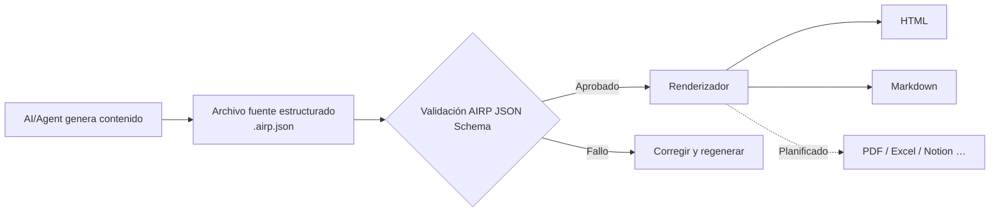

# AIRP — AI Report Protocol (Protocolo de informes con IA)

[🇺🇸 English](./README.md) | [🇨🇳 中文](./README.cn.md) | [🇯🇵 日本語](./README.ja.md) | [🇰🇷 한국어](./README.ko.md) | [🇩🇪 Deutsch](./README.de.md) | [🇫🇷 Français](./README.fr.md) | [🇷🇺 Русский](./README.ru.md) | [🇪🇸 Español](./README.es.md) | [🇧🇷 Português (Brasil)](./README.pt-BR.md) | [🇮🇹 Italiano](./README.it.md)


**Convierte la salida de conversación de AI/Agent en informes estructurados que se pueden validar, renderizar y mantener a largo plazo.**

Al redactar propuestas, retrospectivas o materiales de auditoría en Cursor, Copilot, Claude Code y entornos similares, los registros de chat suelen ser difíciles de entregar tal cual: el formato es inestable, la búsqueda resulta complicada y volver a exportar en otro idioma u otro formato es engorroso. AIRP utiliza un **JSON Schema** unificado para restringir la estructura del informe (similar a los distintos **Block** de contenido de Notion), produce primero un archivo fuente estructurado **`.airp.json`** y, a continuación, exporta **HTML** (lectura/presentación) o **Markdown** (flujos documentales / edición posterior) mediante un **renderizador**.

Repositorio: `https://github.com/maosong-ai/airp`

## ¿Para quién es?

| Rol | Informes típicos |
|---|---|
| Project manager / Producto | Briefs de proyecto, retrospectivas de hitos, riesgos y tareas pendientes |
| Operaciones / Negocio | Resúmenes de campañas, análisis comparativos, decisiones y seguimientos |
| Auditoría interna / Control de calidad | Clasificación de problemas, cadena de evidencias, listas de corrección y verificación |
| Desarrollo / Arquitectura | Planes de migración, revisiones técnicas, pruebas y notas de cambio |

## Capacidades principales

| Capacidad | Descripción |
|---|---|
| **Archivo fuente estructurado** | `.airp.json` organiza el contenido según el Schema; se valida automáticamente tras la generación para reducir el caso de «parece completo pero faltan secciones» |
| **Separación contenido y presentación** | Solo se mantiene el archivo fuente; HTML / Markdown se exportan con el renderizador — cambiar el diseño sin reescribir el contenido |
| **Multilingüe (i18n)** | Un mismo archivo fuente puede incluir textos en varios idiomas (`i18n.locales`); elegir idioma al exportar o al navegar; la interfaz admite chino, inglés, japonés, coreano, alemán, francés, ruso, español, portugués, italiano y más |
| **Temas y diseño** | La exportación HTML permite alternar temas claro/oscuro y otras opciones visuales **sin modificar el contenido** |
| **Extensible** | Próximamente: exportación a PDF, Excel, Notion y otros formatos |

## Inicio rápido

**1. Instalar Skill**

```bash
npx skills add maosong-ai/airp
```

**2. Comandos y artefactos**

| Comando | Artefacto | Uso |
|---|---|---|
| `/airp` | `*.airp.json` | Generar y validar el archivo fuente estructurado (archivo, búsqueda, reprocesado, reexportación) |
| `/airp-dashboard` | Dashboard local | Previsualizar el archivo fuente en el navegador; también exportar HTML / Markdown en línea |
| `/airp-html` | `*.html` | Renderizar un archivo fuente existente como página web monolítica, ideal para compartir y presentar |
| `/airp-markdown` | `*.md` | Exportar Markdown en el idioma (locale) indicado, para Yuque/Feishu/GitHub, etc. |

**3. Flujo recomendado**

```
/airp  →  archivo fuente  →  /airp-html      →  HTML      # lectura y presentación externa
/airp  →  archivo fuente  →  /airp-markdown  →  Markdown  # biblioteca documental, edición posterior
```

**4. Directorio de salida**

Por defecto: `.docs/airp/` dentro del proyecto; se puede indicar otra ruta con `--out <dir>`.

## Flujo de trabajo



## Por qué «archivo fuente + renderizado»

El **JSON Schema** de AIRP (`airp-document.schema.json`) es la **única fuente de verdad (SSOT)** para generación y validación:

- **Verificable**: campos y secciones con restricciones; si la validación falla, se considera incompleto — evita entregas aparentes.
- **Reutilizable**: el archivo fuente sirve para comparar versiones, buscar y automatizar; HTML / Markdown están orientados a la lectura humana.
- **Más estable y eficiente en contexto para la IA**: los Block delimitan la estructura con claridad; en informes largos es menos probable desviarse que con HTML libre, y suele ser más compacto que HTML verboso para la misma información.
- **Varios formatos sin trabajo duplicado**: se edita el archivo fuente una vez y se exporta a web o documento según necesidad.

El cuerpo del informe se compone de varios **Block** (p. ej. sección `section`, tabla `table`, riesgo `risk`, diagrama `mermaid`, etc.). La lista completa de tipos está en el Schema; en el día a día basta indicar el tipo de informe (p. ej. «informe de auditoría», «retrospectiva de proyecto») y `/airp` elige automáticamente la combinación adecuada de bloques.

### Módulos de contenido (por uso)

| Categoría | Block típicos |
|---|---|
| Apertura y resumen | `hero`, `lead`, `pullQuote` |
| Cuerpo y diseño | `section`, `paragraph`, `table`, `callout`, distintas listas |
| Flujos e ilustraciones | `flowSteps`, `mermaid`, `timeline`, `roadmap` |
| Decisiones y riesgos | `comparison`, `decision`, `risk`, `assumption`, `openQuestion` |
| Ejecución y verificación | `checklist`, `statusBoard`, `testResult`, `requirementTrace` |
| Apéndices y referencias | `collapsible`, `tabs`, `appendix`, `glossary`, `citation` |

## Preguntas frecuentes

### ¿Qué archivo conviene conservar?

| Objetivo | Recomendación |
|---|---|
| Archivo de equipo, procesamiento automático, reexportación posterior | `.airp.json` (archivo fuente) |
| Compartir por correo/IM, lectura en presentaciones | `.html` |
| Edición en biblioteca documental, integración con herramientas Markdown | `.md` (`/airp-markdown` + locale) |

### ¿Cómo usar el multilingüismo?

- Indicar en el prompt los idiomas necesarios (p. ej. «/airp <prompt> generar chino, japonés e inglés») → el archivo fuente incluye textos en tres idiomas.  
- Si no se especifica (p. ej. «/airp <prompt>») → el Skill genera un archivo fuente monolingüe según **el idioma de la conversación actual**.

### AIRP vs HTML vs Markdown

No son mutuamente excluyentes: **HTML / Markdown son formatos de exportación orientados a la lectura.**

| Criterio | AIRP (`.airp.json`) | Pedir HTML directo a la IA | Pedir Markdown directo a la IA |
|---|---|---|---|
| **Rol** | Archivo fuente estructurado + validación Schema | Página de presentación final | Documento final |
| **Restricción estructural** | Block + Schema, validable tras generar | Depende del prompt; en páginas largas faltan bloques y el diseño deriva | Depende del estilo de redacción; la jerarquía en textos largos es inconsistente |
| **Multilingüe** | Estructura de textos en varios idiomas | Suele requerir otra página completa o copia manual | Suele requerir varios `.md` |
| **Exportación multiformato** | Un archivo fuente → HTML / Markdown (y PDF/Excel, etc.) | Convertir a Markdown implica reescribir o pérdidas | Convertir a HTML implica reescribir o añadir estilos |
| **Lectura humana** | Renderizar con `/airp-html` o `/airp-markdown` | Abrir un solo archivo, diseño completo | Renderizado en la plataforma, sensación de texto plano |
| **Edición posterior** | La IA modifica el archivo fuente; también exportar Markdown para cambios parciales | Editar HTML es costoso | Lo más natural en herramientas documentales |
| **Archivo / búsqueda / diff** | Estructurado, campos estables | Etiquetas y estilos mezclados, difícil extraer semántica | Amigable al texto, campos no uniformes |
| **Modificaciones multironda con IA** | Editar campos Block, límites claros | Muchas etiquetas, archivo largo, cambios omitidos | Medio; la estructura depende de la disciplina |
| **Token / contexto** | JSON modular, poco redundante | Mismo contenido, mayor volumen, más consumo | Medio |
| **Diseño y tema** | Capa de renderizado intercambiable, archivo fuente intacto | Estilos embebidos en el archivo | Depende de la plataforma destino |
| **Mejor para** | Informes formales, multilingüe, iteración multironda, plantillas de equipo | Página única puntual, alta presentación | Textos cortos, notas, borrador final en Markdown |
| **Menos adecuado para** | Dos o tres frases, sin necesidad de archivo | Validación estricta, multilingüe, pipeline multiformato | Schema estricto, exportación multilingüe con un clic |

> **Conclusión**: usar AIRP cuando se necesita «consistencia + estructura verificable + un contenido, varias exportaciones»; si el formato final ya está claro y solo se publica una versión, HTML o Markdown directo bastan.

## Planes futuros

- Cifrado de archivos fuente y exportaciones
- Exportación con varias hojas (Sheet)
- Renderizadores PDF, Excel, Notion, etc.

---

## Licencia

MIT
