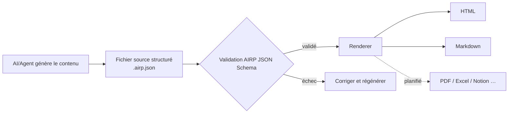

# AIRP — AI Report Protocol (Protocole de rapport IA)

[🇺🇸 English](./README.md) | [🇨🇳 中文](./README.cn.md) | [🇯🇵 日本語](./README.ja.md) | [🇰🇷 한국어](./README.ko.md) | [🇩🇪 Deutsch](./README.de.md) | [🇫🇷 Français](./README.fr.md) | [🇷🇺 Русский](./README.ru.md) | [🇪🇸 Español](./README.es.md) | [🇧🇷 Português (Brasil)](./README.pt-BR.md) | [🇮🇹 Italiano](./README.it.md)


**Transformez la sortie des conversations AI/Agent en rapports structurés, validables, rendus et maintenables sur le long terme.**

Lorsque vous rédigez des propositions, des bilans ou des documents d'audit dans Cursor, Copilot, Claude Code et autres environnements similaires, les transcripts de chat sont souvent difficiles à livrer tels quels : la mise en page est instable, la recherche est difficile, et réexporter dans une autre langue ou un autre format est laborieux. AIRP utilise un **JSON Schema** unifié pour contraindre la structure des rapports (similaire au modèle **Block** de Notion), produit d'abord un fichier source structuré **`.airp.json`**, puis exporte du **HTML** (lecture/présentation) ou du **Markdown** (flux documentaire / réédition) via un **Renderer**.

Dépôt : `https://github.com/maosong-ai/airp`

## À qui s'adresse-t-il

| Rôle | Rapports typiques |
|---|---|
| Chef de projet / Produit | Notes de lancement, bilans de jalons, risques et actions |
| Opérations / Business | Synthèses de campagnes, analyses comparatives, décisions et suivis |
| Audit interne / QA | Niveaux de gravité, chaînes de preuves, listes de correction et de vérification |
| Développement / Architecture | Plans de migration, revues techniques, notes de tests et de changements |

## Fonctionnalités principales

| Fonctionnalité | Description |
|---|---|
| **Fichier source structuré** | `.airp.json` organise le contenu selon le Schema ; validation automatique après génération, réduisant les cas « ça a l'air complet, mais il manque des sections » |
| **Séparation contenu / présentation** | Seul le fichier source est maintenu ; HTML / Markdown sont exportés par le Renderer — changer la mise en page sans réécrire le contenu |
| **Multilingue (i18n)** | Un même fichier source peut porter des textes en plusieurs langues (`i18n.locales`) ; choix de la langue à l'export ou à la consultation ; interface en chinois, anglais, japonais, coréen, allemand, français, russe, espagnol, portugais, italien, etc. |
| **Thèmes et mise en page** | L'export HTML permet de basculer entre thème clair/sombre et autres apparences **sans modifier le contenu** |
| **Extensible** | Prise en charge future de PDF, Excel, Notion et autres formats d'export |

## Démarrage rapide

**1. Installer le Skill**

```bash
npx skills add maosong-ai/airp
```

**2. Commandes et livrables**

| Commande | Livrable | Usage |
|---|---|---|
| `/airp` | `*.airp.json` | Générer et valider le fichier source structuré (archivage, recherche, retraitement, réexport) |
| `/airp-dashboard` | Dashboard local | Prévisualiser le fichier source dans le navigateur ; export HTML / Markdown en ligne |
| `/airp-html` | `*.html` | Rendre un fichier source existant en page web monofichier, pour partage et présentation |
| `/airp-markdown` | `*.md` | Exporter du Markdown pour une locale donnée — Yuque, Feishu, GitHub, etc. |

**3. Chaîne recommandée**

```
/airp  →  Fichier source  →  /airp-html      →  HTML      # lecture externe, présentation
/airp  →  Fichier source  →  /airp-markdown  →  Markdown  # base documentaire, réédition
```

**4. Répertoire de sortie**

Par défaut : `.docs/airp/` dans le projet ; personnalisable avec `--out <dir>`.

## Flux de travail



## Pourquoi « fichier source + rendu »

Le **JSON Schema** d'AIRP (`airp-document.schema.json`) est la **source unique de vérité (SSOT)** pour la génération et la validation :

- **Validable** : champs et sections contraints ; un échec de validation signifie un livrable incomplet — pas de fausse livraison.
- **Réutilisable** : le fichier source convient à la comparaison de versions, à la recherche et à l'automatisation ; HTML / Markdown sont destinés à la lecture humaine.
- **Plus stable et plus économe en tokens pour l'IA** : frontières de Block claires ; les longs rapports dérivent moins qu'un HTML libre et sont généralement plus compacts pour une même quantité d'information.
- **Multi-formats sans double travail** : modifier le fichier source une fois, exporter page web ou documentation selon les besoins.

Le corps du rapport est assemblé à partir de **Blocks** (par ex. `section`, `table`, `risk`, `mermaid`, etc.). Liste complète des types dans le Schema ; au quotidien, indiquez simplement le type de rapport (par ex. « rapport d'audit », « bilan de projet »), et `/airp` choisit la combinaison de blocks adaptée.

### Modules de contenu (par usage)

| Catégorie | Blocks typiques |
|---|---|
| Ouverture et résumé | `hero`, `lead`, `pullQuote` |
| Texte et mise en page | `section`, `paragraph`, `table`, `callout`, diverses listes |
| Flux et schémas | `flowSteps`, `mermaid`, `timeline`, `roadmap` |
| Décisions et risques | `comparison`, `decision`, `risk`, `assumption`, `openQuestion` |
| Exécution et vérification | `checklist`, `statusBoard`, `testResult`, `requirementTrace` |
| Annexes et références | `collapsible`, `tabs`, `appendix`, `glossary`, `citation` |

## FAQ

### Quel fichier conserver ?

| Objectif | Recommandation |
|---|---|
| Archivage d'équipe, traitement machine, réexport ultérieur | `.airp.json` (fichier source) |
| Partage e-mail/IM, lecture en présentation | `.html` |
| Édition en base documentaire, intégration Markdown | `.md` (`/airp-markdown` + locale) |

### Comment utiliser le multilingue ?

- Précisez les langues dans le prompt (par ex. « /airp <prompt> générer en chinois, japonais et anglais ») → le fichier source contient les trois locales.
- Sans précision (par ex. « /airp <prompt> ») → le Skill génère un fichier source monolingue dans la **langue de la conversation en cours**.

### AIRP vs HTML vs Markdown

Ce ne sont pas des alternatives exclusives : **HTML / Markdown sont des formats d'export destinés à la lecture.**

| Critère | AIRP (`.airp.json`) | HTML écrit directement par l'IA | Markdown écrit directement par l'IA |
|---|---|---|---|
| **Rôle** | Fichier source structuré + validation Schema | Page de présentation finie | Document fini |
| **Contrainte structurelle** | Block + Schema, validable après génération | Dépend du prompt ; longues pages perdent des blocks, dérive de mise en page | Dépend des habitudes d'écriture ; hiérarchie incohérente sur longs textes |
| **Multilingue** | Structure de textes multi-locales | Souvent pages entières séparées ou copie manuelle | Souvent plusieurs fichiers `.md` |
| **Export multi-formats** | Même source → HTML / Markdown (et futurs PDF/Excel, etc.) | Conversion Markdown = réécriture ou perte | Conversion HTML = réécriture ou ajout de styles |
| **Lecture humaine** | Rendu via `/airp-html` ou `/airp-markdown` | Ouvrir le monofichier, mise en page complète | Rendu par la plateforme, aspect texte brut |
| **Réédition** | L'IA modifie directement le fichier source ; ou export Markdown pour retouches partielles | Modifier le HTML coûte cher | Le plus naturel dans les outils documentaires |
| **Archivage / recherche / diff** | Structuré, champs stables | Balises et styles mélangés, sémantique difficile à extraire | Texte-friendly, champs non uniformes |
| **Modifications multi-tours par l'IA** | Modifier les champs Block, frontières claires | Nombreuses balises, fichiers longs, oublis fréquents | Moyen ; structure maintenue par discipline |
| **Token / contexte** | JSON modulaire, peu de redondance | Même contenu, volume plus important | Moyen |
| **Mise en page et thème** | Couche de rendu interchangeable, source inchangée | Styles intégrés au fichier | Dépend de la plateforme cible |
| **Mieux adapté pour** | Rapports formels, multilingue, itérations, modèles d'équipe unifiés | Page unique ponctuelle, forte présentation | Textes courts, livrable Markdown final |
| **Moins adapté pour** | Deux-trois phrases, pas besoin d'archivage | Validation stricte, multilingue, pipeline multi-formats | Schema strict, export multilingue en un clic |

> **Conclusion** : utilisez AIRP lorsque vous avez besoin de « cohérence + structure vérifiable + un contenu, plusieurs exports » ; HTML ou Markdown directement si le format final est clair et qu'une seule version suffit.

## Feuille de route

- Chiffrement des fichiers source et des exports
- Export multi-feuilles (multi-Sheet)
- Renderers PDF, Excel, Notion, etc.

---

## Licence

MIT
