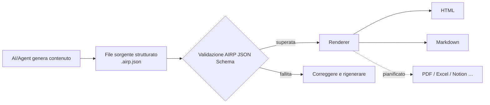

# AIRP — AI Report Protocol (Protocollo di report AI)

[🇺🇸 English](./README.md) | [🇨🇳 中文](./README.cn.md) | [🇯🇵 日本語](./README.ja.md) | [🇰🇷 한국어](./README.ko.md) | [🇩🇪 Deutsch](./README.de.md) | [🇫🇷 Français](./README.fr.md) | [🇷🇺 Русский](./README.ru.md) | [🇪🇸 Español](./README.es.md) | [🇧🇷 Português (Brasil)](./README.pt-BR.md) | [🇮🇹 Italiano](./README.it.md)


**Trasforma l’output di AI/Agent in report strutturati, validabili, renderizzabili e mantenibili nel tempo.**

Quando scrivi piani, retrospettive o materiali di audit in Cursor, Copilot, Claude Code e ambienti simili, le chat sono difficili da consegnare così com’è: layout instabile, ricerca difficile, e ripubblicare in un’altra lingua o formato è laborioso. AIRP usa un unico **JSON Schema** per definire la struttura del report (come i diversi **Block** di Notion), produce prima un file sorgente strutturato **`.airp.json`**, poi esporta tramite un **renderer** in **HTML** (lettura/presentazione) o **Markdown** (flussi documentali / modifica successiva).

Repository: `https://github.com/maosong-ai/airp`

## A chi è rivolto

| Ruolo | Report tipici |
|---|---|
| Project manager / prodotto | Descrizioni di progetto, retrospettive su milestone, rischi e attività |
| Operations / business | Riepiloghi campagne, analisi comparative, decisioni e follow-up |
| Revisione interna / QA | Gravità problemi, catene di evidenza, checklist correzione e verifica |
| Sviluppo / architettura | Piani di migrazione, revisioni tecniche, test e note di modifica |

## Funzionalità principali

| Funzionalità | Descrizione |
|---|---|
| **File sorgente strutturati** | `.airp.json` organizza i contenuti secondo lo Schema; validazione automatica dopo la generazione, per ridurre i casi «sembra completo ma mancano sezioni» |
| **Separazione contenuto e presentazione** | Si mantiene solo il sorgente; HTML / Markdown sono esportati dal renderer—cambiare layout senza riscrivere il testo |
| **Multilingua (i18n)** | Un solo sorgente può contenere testi in più lingue (`i18n.locales`); scegli la lingua in export o in anteprima; l’interfaccia supporta cinese, inglese, giapponese, coreano, tedesco, francese, russo, spagnolo, portoghese, italiano e altre |
| **Temi e layout** | L’export HTML consente tema chiaro/scuro e altre opzioni visive **senza modificare il contenuto** |
| **Estensibile** | In futuro: PDF, Excel, Notion e altri formati di export |

## Avvio rapido

**1. Installare lo Skill**

```bash
npx skills add maosong-ai/airp
```

**2. Comandi e output**

| Comando | Output | Uso |
|---|---|---|
| `/airp` | `*.airp.json` | Genera e valida il sorgente strutturato (archivio, ricerca, post-elaborazione, re-export) |
| `/airp-dashboard` | Dashboard locale | Anteprima del sorgente nel browser; export online di HTML / Markdown, ecc. |
| `/airp-html` | `*.html` | Renderizza un sorgente esistente in una pagina web monofile, per condivisione e presentazione |
| `/airp-markdown` | `*.md` | Esporta Markdown per la locale indicata—Yuque, Feishu, GitHub, ecc. |

**3. Flusso consigliato**

```
/airp  →  sorgente  →  /airp-html      →  HTML      # lettura esterna, presentazione
/airp  →  sorgente  →  /airp-markdown  →  Markdown  # documentazione, modifica successiva
```

**4. Directory di output**

Predefinita: `.docs/airp/` nel progetto; con `--out <dir>` si può specificare un percorso.

## Flusso di lavoro



## Perché «sorgente + renderer»

Il **JSON Schema** di AIRP (`airp-document.schema.json`) è la **Single Source of Truth (SSOT)** per generazione e validazione:

- **Validabile**: campi e sezioni sono vincolati; un errore di validazione significa incompleto—niente consegne apparenti.
- **Riutilizzabile**: i sorgenti sono adatti a diff di versione, ricerca e automazione; HTML / Markdown sono per la lettura umana.
- **Più stabile ed efficiente in token per l’AI**: confini chiari tra Block; i report lunghi deraglionano meno rispetto all’HTML libero e, a parità di informazione, sono di solito più compatti.
- **Più formati senza doppio lavoro**: aggiorni il sorgente una volta, esporti web o documenti quando serve.

Il corpo del report è composto da **Block** (ad es. `section`, `table`, `risk`, `mermaid`, ecc.). Elenco completo dei tipi nello Schema; in pratica basta indicare il tipo di report (es. «report di audit», «retrospettiva di progetto») e `/airp` sceglie i Block adatti.

### Moduli di contenuto (per scopo)

| Categoria | Block tipici |
|---|---|
| Apertura e sintesi | `hero`, `lead`, `pullQuote` |
| Testo e layout | `section`, `paragraph`, `table`, `callout`, vari elenchi |
| Flussi e diagrammi | `flowSteps`, `mermaid`, `timeline`, `roadmap` |
| Decisioni e rischi | `comparison`, `decision`, `risk`, `assumption`, `openQuestion` |
| Esecuzione e verifica | `checklist`, `statusBoard`, `testResult`, `requirementTrace` |
| Appendici e riferimenti | `collapsible`, `tabs`, `appendix`, `glossary`, `citation` |

## Domande frequenti

### Quale file conservare?

| Obiettivo | Consiglio |
|---|---|
| Archivio di team, elaborazione automatica, re-export | `.airp.json` (sorgente) |
| Condivisione email/IM, lettura in presentazione | `.html` |
| Modifica in documentazione, toolchain Markdown | `.md` (`/airp-markdown` + locale) |

### Come funziona il multilingua?

- Indica le lingue nel prompt (es. «/airp <prompt> genera cinese, giapponese e inglese») → il sorgente contiene i tre testi nelle rispettive locale.
- Se non specificato (es. «/airp <prompt>») → lo Skill genera un sorgente monolingua nella **lingua della conversazione corrente**.

### AIRP vs HTML vs Markdown

Non sono in mutua esclusione: **HTML / Markdown sono formati di export per la lettura.**

| Aspetto | AIRP (`.airp.json`) | HTML scritto direttamente dall’AI | Markdown scritto direttamente dall’AI |
|---|---|---|---|
| **Ruolo** | Sorgente strutturato + validazione Schema | Pagina di presentazione finita | Documento finito |
| **Struttura** | Block + Schema, validabile dopo la generazione | Dipende dal prompt; pagine lunghe perdono Block, il layout deriva | Dipende dalle abitudini di scrittura; documenti lunghi perdono gerarchia |
| **Multilingua** | Struttura testi multi-locale | Spesso pagine intere separate o copia manuale | Spesso più file `.md` |
| **Export multi-formato** | Stesso sorgente → HTML / Markdown (e in futuro PDF/Excel, ecc.) | Conversione a Markdown richiede riscrittura o perdite | HTML richiede riscrittura o stili aggiuntivi |
| **Lettura umana** | Render con `/airp-html` o `/airp-markdown` | Apri il file, layout completo | La piattaforma renderizza; forte sensazione di testo piano |
| **Modifica successiva** | L’AI modifica il sorgente; oppure export Markdown per edit parziali | Modificare HTML è oneroso | Più naturale negli strumenti documentali |
| **Archivio / ricerca / diff** | Strutturato, campi stabili | Tag e stili mescolati, semantica difficile da estrarre | Testo-friendly, campi non uniformi |
| **Più round con l’AI** | Modifica campi Block, confini chiari | Molti tag, file lunghi, modifiche facili da tralasciare | Medio; struttura per disciplina |
| **Token / contesto** | JSON modulare, meno ridondanza | Stesso contenuto, footprint maggiore | Medio |
| **Layout e tema** | Il renderer cambia; il sorgente resta uguale | Stili incorporati nel file | Dipende dalla piattaforma di destinazione |
| **Ideale per** | Report formali, multilingua, team iterativi, template uniformi | Pagine singole una tantum, forte presentazione | Note brevi, deliverable finale in Markdown |
| **Meno adatto a** | Note di due righe, nessun archivio | Validazione forte, multilingua, pipeline multi-formato | Schema forte, export multilingua in un clic |

> **Conclusione**: usa AIRP quando servono coerenza, struttura verificabile e una sola fonte con molti export; usa HTML o Markdown direttamente quando il formato finale è fisso e serve una sola versione.

## Roadmap

- Crittografia per sorgenti ed export
- Export pagine multi-foglio
- Renderer PDF, Excel, Notion e altri

---

## Licenza

MIT
