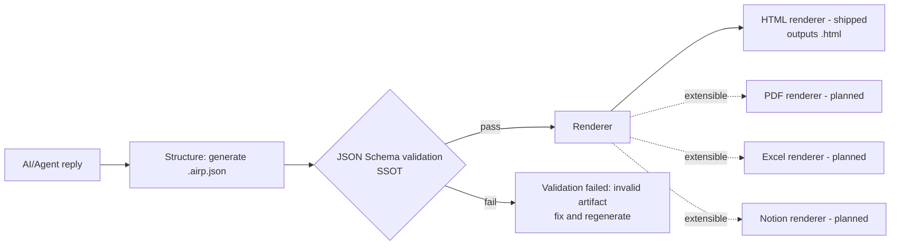

# AIRP — AI Report Protocol

[🇺🇸 English](./README.md) | [🇨🇳 中文](./README.cn.md) | [🇯🇵 日本語](./README.ja.md)


AI/Agent が出力する技術レポートを、**検証可能・レンダリング可能・アーカイブ可能**なプロダクト品質の成果物に変換します。

AIRP は安定した **JSON Schema（単一の真実の源 / SSOT）** によってレポート構造（blocks）を制約し、**Dashboard** と **静的 HTML レンダリング** を提供します。これにより、チャット上の出力を再利用・共有できるレポートファイル（`.airp.json` / `.html`）にできます。

さらに AIRP は **コンテンツ（schema）** と **表示（renderer）** を分離しています：

- **レンダラーの拡張性**：schema を変えずに PDF / Excel / Notion などへ拡張可能
- **多言語（zh/ja/en）**：1 つのレポートに複数言語の文言を持てます。レンダラーは選択した locale で出力します
- **スキン/テーマ**：コンテンツを変えずに見た目（ライト/ダーク、ブランドカラー、タイポ密度など）を切り替え可能

リポジトリ：`https://github.com/maosong-ai/airp`

## ユースケース

- **リファクタ/移行レポート**：範囲、影響、変更一覧、ロールバック戦略、リスクと検証
- **監査/診断レポート**：重要度分類、エビデンスチェーン、修復提案、アクションアイテム追跡
- **技術提案/レビュー記録**：意思決定、トレードオフ、前提、マイルストーン、受け入れ基準

## 仕組み（AI から成果物レポートへ）

AIRP は「AI の返信内容」を検証可能な構造化データに変換し、レンダラーに渡して読みやすく共有できる成果物を出力します（現時点では HTML、将来的に他のレンダラーも拡張予定）。



## クイックスタート（skill のインストール）

インストール：

```bash
npx skills add maosong-ai/airp
```

デフォルト出力ディレクトリ：

- プロジェクト内：`.docs/airp/`
- 上書き：`--out <dir>` または環境変数 `AIRP_OUT_DIR`

コマンド一覧：

| Command | Output | Purpose |
|---|---|---|
| `/airp` | `*.airp.json` | 構造化された機械検証可能レポート（アーカイブ/索引/後処理向け） |
| `/airp-html` | `*.html`（単一ファイル） | 既存の `*.airp.json` を共有・閲覧用の単一 HTML にレンダリング |
| `/airp-dashboard` | ローカル Dashboard（ブラウザ） | `.airp.json` のアップロード/閲覧/レンダリング（インタラクティブ表示） |

## コア原則：Schema は単一の真実の源（SSOT）

AIRP の **JSON Schema** は生成と検証の唯一の真実の源です：`./airp-document.schema.json`

- **検証可能**：「正しそうな自然言語」を、制約を満たすか失敗するかの構造化成果物に変換し、疑似成功を防ぎます。
- **レンダリング可能/拡張可能**：コンテンツは安定した schema で表現し、レンダラーは表示だけに集中します。PDF/Excel/Notion などの追加はコンテンツ生成ロジックの変更を不要にします。
- **アーカイブ/索引/比較が容易**：`*.airp.json` をソースとして保存でき、検索、集計、差分比較、自動処理に適します（純 HTML/Markdown より機械処理向き）。
- **AI/Agent に優しくトークン効率が良い**：JSON の境界が明確で、AI が安定して読み書きし制約に従いやすくなります。構造化フィールドの再利用で冗長な説明を減らし、同等の情報密度なら長文 Markdown/HTML より短くなることが多く、後続工程で再利用しやすいです。
- **進化可能だが暴走しない**：schema が required/optional と `additionalProperties: false` を明示し、フォーマット進化の境界と互換性を制御します。

## サポートされる Block

> 正式な一覧：schema 内の `blocks[].type` にある `const` 値（大小文字区別）。

| Block (type) | Purpose |
|---|---|
| `hero` | 冒頭サマリーと数値結論のためのメトリクスカード |
| `section` | 章のコンテナ（blocks をネスト）でアウトライン/構造を整理 |
| `group` | 関連コンテンツをまとめるグループコンテナ（blocks をネスト） |
| `divider` | ブロック間の視覚的な区切り |
| `spacer` | 余白（レイアウトのリズム調整） |
| `heading` | 非コンテナの見出し（小見出し/階層見出し） |
| `paragraph` | 本文（Markdown） |
| `lead` | 章冒頭の導入/要約段落 |
| `pullQuote` | 重要な結論/主張を強調する引用 |
| `blockquote` | 外部資料や原文の引用、エビデンス引用 |
| `callout` | リスク/注意/結論を強調する通知ブロック（info/warn/success など） |
| `bulletList` | 箇条書き（順不同） |
| `numberedList` | 手順/フロー用の番号付きリスト |
| `checklist` | 検証項目/ToDo/受け入れのチェックリスト |
| `definitionList` | 用語-説明の定義リスト |
| `table` | 表形式データ |
| `comparison` | 並列比較（例：案 A vs 案 B、blocks をネスト） |
| `collection` | カード/パネルの集合（各アイテムに blocks をネスト） |
| `keyValueList` | パラメータ/設定/要約のキー・バリュー |
| `statusBoard` | タスク/モジュールの状態・進捗ボード |
| `code` | コード、コマンド、ログ断片 |
| `codeDiff` | 変更差分（Diff） |
| `fileTree` | ディレクトリ/モジュールのツリー |
| `fileChangeList` | 変更ファイル一覧と説明 |
| `mermaid` | Mermaid 図（フロー/シーケンス/アーキテクチャなど） |
| `architectureOverview` | アーキテクチャ概要（Mermaid + 説明） |
| `flowSteps` | フローをステップカードとして表現 |
| `decision` | 意思決定の記録（選択肢と理由） |
| `risk` | リスク（内容、レベル、緩和、検証） |
| `assumption` | 前提（仮定）と検証方法 |
| `constraint` | 制約（技術/ビジネス/リソース） |
| `openQuestion` | 未決事項（要確認/フォローアップ） |
| `timeline` | タイムライン（時系列の出来事/マイルストーン） |
| `roadmap` | ロードマップ（フェーズ、マイルストーン、リリーステンポ） |
| `requirementTrace` | 要求-実装-テストのトレーサビリティ |
| `testResult` | テスト結果（項目、結果、証拠） |
| `apiInventory` | API 一覧（用途、リスク、変更点） |
| `linkList` | 関連リンク、PR、ドキュメント |
| `glossary` | 用語集（略語含む） |
| `citation` | 参考文献/出典（エビデンスの根拠） |
| `image` | 画像（スクリーンショット、図、証拠） |
| `embed` | 外部コンテンツ埋め込み（iframe、可視化リンク等） |
| `collapsible` | 折りたたみブロック（blocks をネスト） |
| `tabs` | タブ（同一位置で複数内容を切替、blocks をネスト） |
| `appendix` | 付録（blocks をネスト） |
| `agentNote` | Agent 向けメモ（生成時の補足、嗜好、ヒント：作者/レビュー向け） |

## ロードマップ

- **パスワード保護された成果物**：`*.airp.json` / `*.html` を暗号化/復号し、配布と保管の安全性を向上。
- **複数ページ文書**：1 つのレポートをページ/章に分割して出力し、長文の閲覧、印刷、モジュール別納品を容易に。
- **レンダラー拡張**：schema を安定（SSOT）に保ったまま、PDF / Excel / Notion などへ拡張。

## FAQ

### 成果物はどこに出力されますか？

- デフォルト：プロジェクト内の `.docs/airp/`
- 上書き：`--out <dir>` または `AIRP_OUT_DIR`

### どのファイルを保存すべきですか？

- **アーカイブ/後処理が必要**：`*.airp.json`（構造化ソース）を保存
- **共有/閲覧が必要**：`*.html`（単一ファイルレポート）を保存

> Tip：`/airp` で `*.airp.json` を生成し、その後 `/airp-html` で `*.html` を出力するチェーン利用がおすすめです。
> Example: `/airp /airp-html xxxxxx`

---

## License

MIT
