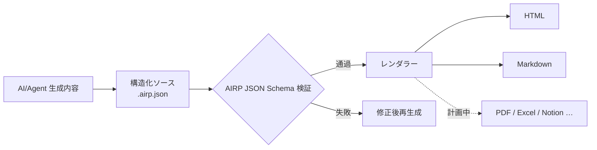

# AIRP — AI Report Protocol（AI レポートプロトコル）

[🇺🇸 English](./README.md) | [🇨🇳 中文](./README.cn.md) | [🇯🇵 日本語](./README.ja.md) | [🇰🇷 한국어](./README.ko.md) | [🇩🇪 Deutsch](./README.de.md) | [🇫🇷 Français](./README.fr.md) | [🇷🇺 Русский](./README.ru.md) | [🇪🇸 Español](./README.es.md) | [🇧🇷 Português (Brasil)](./README.pt-BR.md) | [🇮🇹 Italiano](./README.it.md)


**AI/Agent の会話出力を、検証可能・レンダリング可能・長期メンテナンス可能な構造化レポートに変換します。**

Cursor、Copilot、Claude Code などで提案書、振り返り、監査資料を書くとき、チャットログはそのまま納品しにくいことが多いです。レイアウトが不安定、検索しにくい、別言語や別形式での再配布も手間がかかります。AIRP は統一された **JSON Schema** でレポート構造を制約し（Notion の複数 **Block** コンテンツモデルに類似）、まず構造化ソースファイル **`.airp.json`** を生成し、**レンダラー** 経由で **HTML**（閲覧/プレゼン）または **Markdown**（ドキュメントフロー/再編集）をエクスポートします。

リポジトリ：`https://github.com/maosong-ai/airp`

## 対象ユーザー

| 役割 | 典型的なレポート |
|---|---|
| プロジェクトマネージャー / プロダクト | 立項説明、マイルストーン振り返り、リスクと ToDo |
| オペレーション / ビジネス | キャンペーン総括、ベンチマーク分析、意思決定とフォローアップ |
| 内部監査 / 品質管理 | 重要度分類、エビデンスチェーン、是正と検証チェックリスト |
| 開発 / アーキテクチャ | 移行計画、技術レビュー、テストと変更説明 |

## コア機能一覧

| 機能 | 説明 |
|---|---|
| **構造化ソースファイル** | `.airp.json` は Schema に従ってコンテンツを整理。生成後に自動検証し、「見た目は完成だが実は欠落がある」状況を減らす |
| **コンテンツと表示の分離** | 本文はソースのみをメンテナンス。HTML / Markdown はレンダラーがエクスポート。レイアウト変更で本文を書き直す必要なし |
| **多言語（i18n）** | 1 つのソースに複数言語の文案（`i18n.locales`）を保持可能。エクスポートや閲覧時に言語を選択。UI は中・英・日・韓・独・仏・露・西・葡・意などに対応 |
| **テーマとレイアウト** | HTML エクスポートでライト/ダークテーマなど外観を切替。**本文は変更しない** |
| **拡張性** | 今後 PDF、Excel、Notion などのエクスポート方式に対応予定 |

## クイックスタート

**1. Skill のインストール**

```bash
npx skills add maosong-ai/airp
```

**2. コマンドと成果物**

| コマンド | 成果物 | 用途 |
|---|---|---|
| `/airp` | `*.airp.json` | 構造化ソースの生成と検証（アーカイブ、検索、後処理、再エクスポート） |
| `/airp-dashboard` | ローカル Dashboard | ブラウザでソースファイルをプレビュー。HTML / Markdown などのオンラインエクスポートも可能 |
| `/airp-html` | `*.html` | 既存ソースを単一 HTML にレンダリング。共有とプレゼン向け |
| `/airp-markdown` | `*.md` | 指定 locale で Markdown をエクスポート。Yuque、Feishu、GitHub など向け |

**3. 推奨フロー**

```
/airp  →  ソース  →  /airp-html      →  HTML      # 外部向け閲覧、プレゼン
/airp  →  ソース  →  /airp-markdown  →  Markdown  # ドキュメント、継続編集
```

**4. 出力ディレクトリ**

デフォルト：プロジェクト内 `.docs/airp/`。`--out <dir>` でパスを指定可能。

## ワークフロー



## なぜ「ソース + レンダリング」が必要か

AIRP の **JSON Schema**（`airp-document.schema.json`）は生成と検証の**唯一の規範（SSOT）**です：

- **検証可能**：フィールドと章に制約があり、検証失敗は未完成とみなし、疑似納品を防ぐ。
- **再利用可能**：ソースはバージョン比較、検索、自動化に適する。HTML / Markdown は人間向け閲覧。
- **AI にとって安定・トークン効率が良い**：Block 構造の境界が明確。長文レポートは自由 HTML より逸脱しにくく、同等情報量では通常よりコンパクト。
- **多形式で重複作業なし**：ソースを 1 回更新し、必要に応じて Web やドキュメントをエクスポート。

レポート本文は複数の **Block**（章 `section`、表 `table`、リスク `risk`、フロー図 `mermaid` など）で構成。完全な型一覧は Schema を参照。日常ではレポート種別（「監査レポート」「プロジェクト振り返り」など）を伝えるだけで、`/airp` が適切な Block 組み合わせを選びます。

### コンテンツモジュール（用途別）

| カテゴリ | 典型的な Block |
|---|---|
| 冒頭と要約 | `hero`、`lead`、`pullQuote` |
| 本文とレイアウト | `section`、`paragraph`、`table`、`callout`、各種リスト |
| フローと図示 | `flowSteps`、`mermaid`、`timeline`、`roadmap` |
| 意思決定とリスク | `comparison`、`decision`、`risk`、`assumption`、`openQuestion` |
| 実行と検証 | `checklist`、`statusBoard`、`testResult`、`requirementTrace` |
| 付録と参考 | `collapsible`、`tabs`、`appendix`、`glossary`、`citation` |

## よくある質問

### どのファイルを残すべきか？

| 目的 | 推奨 |
|---|---|
| チームアーカイブ、機械処理、再エクスポート | `.airp.json`（ソース） |
| メール/IM 共有、プレゼン閲覧 | `.html` |
| ドキュメント編集、Markdown ツールチェーン連携 | `.md`（`/airp-markdown` + locale） |

### 多言語の使い方

- プロンプトで言語を指定（例：「/airp <プロンプト> 中日英三言語で生成」）→ ソースに三言語文案を含む。
- 未指定時（例：「/airp <プロンプト>」）→ Skill は**現在の会話言語**で単一言語ソースを生成。

### AIRP vs HTML vs Markdown

三者は排他的ではありません：**HTML / Markdown は閲覧向けのエクスポート形態です。**

| 比較項目 | AIRP（`.airp.json`） | AI に直接 HTML を書かせる | AI に直接 Markdown を書かせる |
|---|---|---|---|
| **役割** | 構造化ソース + Schema 検証 | 完成展示ページ | 完成ドキュメント |
| **構造制約** | Block + Schema、生成後検証可能 | Prompt 依存、長ページで Block 欠落・レイアウト漂移 | 執筆習慣依存、長文で階層不一致 |
| **多言語** | 多言語文案構造 | 別ページ保存や手動コピーが多い | 複数 `.md` が必要なことが多い |
| **多形式エクスポート** | 同一ソース → HTML / Markdown（今後 PDF/Excel 等） | Markdown 変換は書き直しまたは劣化変換 | HTML は書き直しまたはスタイル追加 |
| **人間向け閲覧** | `/airp-html` または `/airp-markdown` でレンダリング | 単一ファイルを開くだけ、レイアウト完備 | プラットフォームでレンダリング、プレーンテキスト感 |
| **再編集** | AI がソースを直接編集。Markdown エクスポートで部分編集も可 | HTML 編集コスト高 | ドキュメントツールで最も自然 |
| **アーカイブ / 検索 / diff** | 構造化、フィールド安定 | タグとスタイル混在、意味抽出困難 | テキスト向き、フィールド非統一 |
| **AI 多ラウンド修正** | Block フィールド編集、境界明確 | タグ多、ファイル長、修正漏れしやすい | 中程度。構造は自律維持 |
| **Token / コンテキスト** | モジュール化 JSON、冗長性少 | 同内容でも体積大、占有高 | 中程度 |
| **レイアウトとテーマ** | レンダリング層で切替、ソース不変 | スタイルがファイル内に埋込 | ターゲットプラットフォーム依存 |
| **向いている** | 正式レポート、多言語、多ラウンド反復、チーム統一テンプレート | 一回限り単ページ、強い展示 | 短文、メモ、Markdown 最終稿 |
| **向いていない** | 数行程度・アーカイブ不要 | 強い検証、多言語、多形式パイプライン | 強い Schema、ワンクリック多言語エクスポート |

> **結論**：「一貫性 + 検査可能な構造 + 一つのコンテンツで複数エクスポート」が必要なら AIRP。最終形式が明確で一版のみなら、直接 HTML または Markdown で十分。

## 今後の計画

- ソースとエクスポート成果物の暗号化
- マルチ Sheet ページエクスポート
- PDF、Excel、Notion などのレンダラー

---

## ライセンス

MIT
