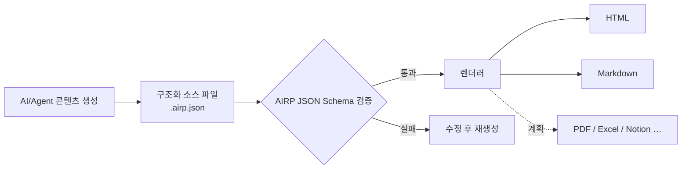

# AIRP — AI Report Protocol（AI 보고서 프로토콜）

[🇺🇸 English](./README.md) | [🇨🇳 中文](./README.cn.md) | [🇯🇵 日本語](./README.ja.md) | [🇰🇷 한국어](./README.ko.md) | [🇩🇪 Deutsch](./README.de.md) | [🇫🇷 Français](./README.fr.md) | [🇷🇺 Русский](./README.ru.md) | [🇪🇸 Español](./README.es.md) | [🇧🇷 Português (Brasil)](./README.pt-BR.md) | [🇮🇹 Italiano](./README.it.md)


**AI/Agent의 대화 출력을 검증 가능하고, 렌더링 가능하며, 장기적으로 유지보수할 수 있는 구조화 보고서로 바꿉니다.**

Cursor, Copilot, Claude Code 등의 환경에서 기획안, 회고, 감사 자료를 작성할 때 채팅 기록만으로는 그대로 전달하기 어렵습니다. 레이아웃이 불안정하고 검색도 어렵으며, 다른 언어나 형식으로 다시 배포하기도 번거롭습니다. AIRP는 통일된 **JSON Schema**로 보고서 구조를 제약합니다(Notion의 다양한 **Block** 콘텐츠 블록으로 구성되는 방식과 유사). 먼저 구조화 소스 파일 **`.airp.json`**을 만든 뒤 **렌더러**를 통해 **HTML**(열람/발표) 또는 **Markdown**(문서 흐름/재편집)을 보냅니다.

저장소: `https://github.com/maosong-ai/airp`

## 대상 사용자

| 역할 | 대표 보고서 |
|---|---|
| 프로젝트 매니저 / 제품 | 착수 설명, 마일스톤 회고, 리스크 및 할 일 |
| 운영 / 비즈니스 | 캠페인 요약, 벤치마크 분석, 의사결정 및 후속 조치 |
| 내부 감사 / 품질 관리 | 이슈 심각도 분류, 증거 체인, 시정 및 검증 체크리스트 |
| 개발 / 아키텍처 | 마이그레이션 계획, 기술 검토, 테스트 및 변경 설명 |

## 핵심 기능 한눈에 보기

| 기능 | 설명 |
|---|---|
| **구조화 소스 파일** | `.airp.json`은 Schema에 따라 콘텐츠를 구성합니다. 생성 후 자동 검증으로 「완성된 것처럼 보이지만 실제로는 구간이 빠진」 상황을 줄입니다 |
| **콘텐츠와 표현 분리** | 본문은 소스만 유지합니다. HTML / Markdown은 렌더러가 보냅니다. 레이아웃을 바꿀 때 본문을 다시 쓸 필요가 없습니다 |
| **다국어(i18n)** | 하나의 소스에 다국어 문안(`i18n.locales`)을 담을 수 있습니다. 보내기·열람 시 언어를 선택합니다. UI는 중·영·일·한·독·불·러·서·포·이 등을 지원합니다 |
| **테마와 레이아웃** | HTML 보내기에서 라이트/다크 테마 등 외관을 전환할 수 있으며, **본문은 변경하지 않습니다** |
| **확장성** | 향후 PDF, Excel, Notion 등 보내기 방식을 추가할 예정입니다 |

## 빠른 시작

**1. Skill 설치**

```bash
npx skills add maosong-ai/airp
```

**2. 명령과 산출물**

| 명령 | 산출물 | 용도 |
|---|---|---|
| `/airp` | `*.airp.json` | 구조화 소스 파일 생성 및 검증(보관, 검색, 후처리, 재보내기) |
| `/airp-dashboard` | 로컬 Dashboard | 브라우저에서 소스 파일을 미리보고, HTML / Markdown 등을 온라인으로 보낼 수도 있습니다 |
| `/airp-html` | `*.html` | 기존 소스 파일을 단일 HTML 페이지로 렌더링. 공유 및 발표용 |
| `/airp-markdown` | `*.md` | 지정 locale로 Markdown 보내기. Yuque, Feishu, GitHub 등 |

**3. 권장 워크플로**

```
/airp  →  소스 파일  →  /airp-html      →  HTML      # 외부 열람, 발표
/airp  →  소스 파일  →  /airp-markdown  →  Markdown  # 문서 라이브러리, 계속 편집
```

**4. 출력 디렉터리**

기본값: 프로젝트 내 `.docs/airp/`; `--out <dir>`로 경로를 지정할 수 있습니다.

## 워크플로



## 왜 「소스 파일 + 렌더링」이 필요한가

AIRP의 **JSON Schema**(`airp-document.schema.json`)는 생성과 검증의 **유일한 규범(SSOT)**입니다:

- **검증 가능**: 필드와 섹션에 제약이 있습니다. 검증에 실패하면 미완성으로 간주하여 가짜 납품을 방지합니다.
- **재사용 가능**: 소스 파일은 버전 비교, 검색, 자동화에 적합합니다. HTML / Markdown은 사람이 읽기 위한 형태입니다.
- **AI에 더 안정적·컨텍스트 절약**: Block 구조의 경계가 분명합니다. 긴 보고서는 자유롭게 작성한 HTML보다 이탈하기 어렵고, 같은 정보량에서도 보통 더 컴팩트합니다.
- **여러 형식을 중복 작업 없이**: 소스를 한 번만 수정하고 필요에 따라 웹이나 문서로 보냅니다.

보고서 본문은 여러 **Block**(예: 섹션 `section`, 표 `table`, 리스크 `risk`, 흐름도 `mermaid` 등)으로 조립됩니다. 전체 타입 목록은 Schema를 참고하세요. 일상적으로는 보고서 유형(예: 「감사 보고서」「프로젝트 회고」)만 설명하면 `/airp`가 알맞은 Block 조합을 자동으로 선택합니다.

### 콘텐츠 모듈(용도별 분류)

| 범주 | 대표 Block |
|---|---|
| 서두와 요약 | `hero`, `lead`, `pullQuote` |
| 본문과 레이아웃 | `section`, `paragraph`, `table`, `callout`, 각종 목록 |
| 흐름과 도식 | `flowSteps`, `mermaid`, `timeline`, `roadmap` |
| 의사결정과 리스크 | `comparison`, `decision`, `risk`, `assumption`, `openQuestion` |
| 실행과 검증 | `checklist`, `statusBoard`, `testResult`, `requirementTrace` |
| 부록과 참고 | `collapsible`, `tabs`, `appendix`, `glossary`, `citation` |

## 자주 묻는 질문

### 어떤 파일을 보관해야 하나요?

| 목적 | 권장 보관 |
|---|---|
| 팀 보관, 기계 처리, 이후 재보내기 | `.airp.json`(소스 파일) |
| 이메일/IM 공유, 발표 열람 | `.html` |
| 문서 라이브러리 편집, Markdown 툴체인 연동 | `.md`(`/airp-markdown` + locale) |

### 다국어는 어떻게 사용하나요?

- 프롬프트에 필요한 언어를 명시합니다(예: 「/airp <프롬프트> 중·일·영 3개 언어로 생성」) → 소스 파일에 3개 언어 문안이 포함됩니다.
- 명시하지 않으면(예: 「/airp <프롬프트>」) → Skill이 **현재 대화 언어**로 단일 언어 소스 파일을 생성합니다.

### AIRP vs HTML vs Markdown

셋은 배타적이지 않습니다: **HTML / Markdown은 열람용 보내기 형태입니다.**

| 비교 항목 | AIRP(`.airp.json`) | AI에 HTML을 직접 작성 | AI에 Markdown을 직접 작성 |
|---|---|---|---|
| **역할** | 구조화 소스 파일 + Schema 검증 | 완성된 전시 페이지 | 완성된 문서 |
| **구조 제약** | Block + Schema, 생성 후 검증 가능 | Prompt에 의존, 긴 페이지에서 Block 누락·레이아웃 drift | 작성 습관에 의존, 긴 글에서 계층 불일치 |
| **다국어** | 다국어 문안 구조 | 별도 전체 페이지 저장 또는 수동 복사가 흔함 | 여러 `.md`가 필요한 경우가 많음 |
| **다형식 보내기** | 동일 소스 → HTML / Markdown(및 향후 PDF/Excel 등) | Markdown 변환은 재작성 또는 손실 변환 | HTML은 재작성 또는 스타일 추가 |
| **사람이 읽기** | `/airp-html` 또는 `/airp-markdown`으로 렌더링 | 단일 파일을 열면 바로 열람, 레이아웃 완비 | 플랫폼 렌더링, 순수 텍스트 느낌 |
| **재편집** | AI가 소스를 직접 수정. Markdown 보내기로 부분 수정도 가능 | HTML 수정 비용이 높음 | 문서 도구에서 가장 자연스러움 |
| **보관 / 검색 / diff** | 구조화, 필드 안정 | 태그와 스타일 혼재, 의미 추출 어려움 | 텍스트 친화적, 필드 비통일 |
| **AI 여러 차례 수정** | Block 필드 수정, 경계가 분명 | 태그가 많고 파일이 길어 수정을 빠뜨리기 쉬움 | 중간 수준. 구조는 자율적으로 유지 |
| **Token / 컨텍스트** | 모듈화 JSON, 중복 적음 | 같은 내용도 부피가 커 점유가 높음 | 중간 수준 |
| **레이아웃과 테마** | 렌더링 계층에서 전환, 소스 불변 | 스타일이 파일에 내장 | 대상 플랫폼에 따라 다름 |
| **더 적합** | 공식 보고서, 다국어, 여러 차례 반복, 팀 통일 템플릿 | 일회성 단일 페이지, 강한 전시 | 짧은 글, 메모, Markdown이 최종본 |
| **덜 적합** | 두세 문장, 보관 불필요 | 강한 검증, 다국어, 다형식 파이프라인 | 강한 Schema, 원클릭 다국어 보내기 |

> **결론**: 「일관성 + 검사 가능한 구조 + 하나의 콘텐츠로 여러 보내기」가 필요하면 AIRP를 사용하세요. 최종 형식이 분명하고 한 버전만 필요하면 HTML 또는 Markdown을 직접 사용하면 됩니다.

## 향후 계획

- 소스 파일과 보내기 산출물 암호화
- 다중 Sheet 페이지 보내기
- PDF, Excel, Notion 등 렌더러

---

## 라이선스

MIT
