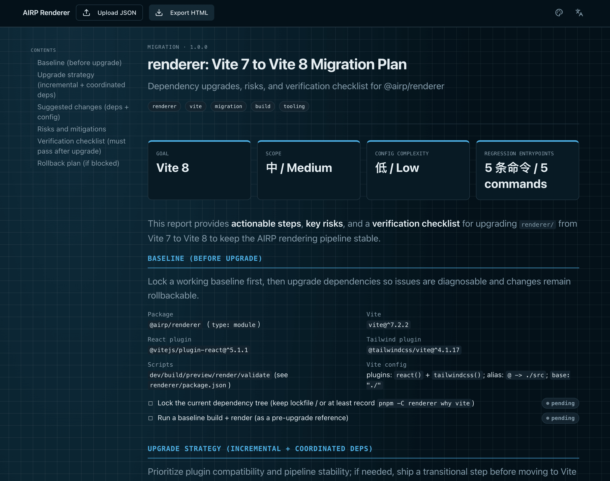

# AIRP — AI Report Protocol

[🇺🇸 English](./README.md) | [🇨🇳 中文](./README.cn.md) | [🇯🇵 日本語](./README.ja.md)



Turn AI/Agent technical reports into **validatable, renderable, archivable** product-grade deliverables.

AIRP uses a stable **JSON Schema (single source of truth)** to constrain report structure (blocks), and ships a **Dashboard** plus **static HTML rendering** so chat output becomes reusable, shareable report files (`.airp.json` / `.html`).

AIRP also decouples **content (schema)** from **presentation (renderer)**:

- **Extensible renderers**: extend to PDF / Excel / Notion and other targets without changing the schema
- **Multilingual (zh/ja/en)**: one report can carry copy in multiple languages; renderers output the chosen locale
- **Skins/themes**: switch visual skins (light/dark, brand colors, typography density) without changing content

Repository: `https://github.com/maosong-ai/airp`

## Use cases

- **Refactor/migration reports**: scope, impact, change lists, rollback strategy, risks and verification
- **Audit/diagnostic reports**: severity tiers, evidence chains, remediation, action-item tracking
- **Technical proposals/review records**: decisions, trade-offs, assumptions, milestones and acceptance criteria

## How it works (from AI to deliverable report)

AIRP turns “AI reply content” into validatable structured data, then hands it to renderers for reading and sharing (HTML today; more renderers planned).

```mermaid
flowchart LR
  A[AI/Agent reply] --> B[Structure: generate .airp.json]
  B --> C{JSON Schema validation<br/>SSOT}
  C -- pass --> D[Renderer]
  C -- fail --> E[Validation failed: invalid artifact<br/>fix and regenerate]
  D --> H[HTML renderer (shipped)<br/>outputs .html]
  D -. extensible .-> P[PDF renderer (planned)]
  D -. extensible .-> X[Excel renderer (planned)]
  D -. extensible .-> N[Notion renderer (planned)]
```

## Quick start (install skill)

Install:

```bash
npx skills add maosong-ai/airp
```

Default output directory:

- In project: `.docs/airp/`
- Override: `--out <dir>` or env var `AIRP_OUT_DIR`

Commands:

| Command | Output | Purpose |
|---|---|---|
| `/airp` | `*.airp.json` | Structured, machine-validatable report (archive/index/post-process) |
| `/airp-html` | `*.html` (single file) | Render existing `*.airp.json` to a shareable, readable single-file HTML |
| `/airp-dashboard` | Local Dashboard (browser) | Upload/browse/render `.airp.json` for interactive viewing |

## Core principle: Schema is the single source of truth (SSOT)

AIRP’s **JSON Schema** is the sole source for generation and validation: `./airp-document.schema.json`

- **Validatable**: turns “plausible natural language” into structured output that either satisfies constraints or fails—no false positives.
- **Renderable/extensible**: content expressed in a stable schema; renderers only handle presentation. New PDF/Excel/Notion renderers do not require changing content production.
- **Archivable/indexable/comparable**: `*.airp.json` as source files for search, aggregation, diffing, and automation (better for machines than plain HTML/Markdown).
- **AI/Agent-friendly and token-efficient**: clear JSON boundaries make reads/writes and constraint adherence more reliable; structured field reuse cuts redundant prose; at similar information density, usually shorter than long Markdown/HTML and easier to reuse downstream.
- **Evolvable but bounded**: schema defines required/optional fields and `additionalProperties: false` so format evolution stays controlled and compatibility predictable.

## Supported blocks

> Authoritative list: `const` values on `blocks[].type` in the schema (case-sensitive).

| Block (type) | Purpose |
|---|---|
| `hero` | Header metric cards for opening summary and quantitative conclusions |
| `section` | Section container (nested blocks) for outline and structure |
| `group` | Group container (nested blocks) to bundle related content |
| `divider` | Visual separator between content blocks |
| `spacer` | Vertical spacing for layout rhythm |
| `heading` | Non-container heading for subsections and hierarchy |
| `paragraph` | Body text (Markdown) for general explanation |
| `lead` | Lead/summary paragraph at section openings |
| `pullQuote` | Emphasized quote for a key conclusion or viewpoint |
| `blockquote` | Quoted material or verbatim evidence |
| `callout` | Prominent info/warning/success blocks for risks, notes, conclusions |
| `bulletList` | Unordered list for bullet points |
| `numberedList` | Ordered list for steps and procedures |
| `checklist` | Checklist for verification, todos, acceptance items |
| `definitionList` | Term–definition pairs for concepts and standards |
| `table` | Tabular data and structured lists |
| `comparison` | Side-by-side comparison (e.g. option A vs B; nested blocks) |
| `collection` | Card/panel collections with nested blocks per item |
| `keyValueList` | Key–value pairs for params, config, summary fields |
| `statusBoard` | Status board for tasks/modules and progress |
| `code` | Code, commands, log snippets |
| `codeDiff` | Before/after code diff |
| `fileTree` | Directory or module tree |
| `fileChangeList` | Changed files with descriptions |
| `mermaid` | Mermaid diagrams (flow, sequence, architecture) |
| `architectureOverview` | Architecture overview (Mermaid + narrative) |
| `flowSteps` | Process broken into step cards |
| `decision` | Decision record with options and rationale |
| `risk` | Risk description, level, mitigation, verification |
| `assumption` | Assumptions and how to validate them |
| `constraint` | Technical, business, or resource constraints |
| `openQuestion` | Open items and follow-ups |
| `timeline` | Chronological events and milestones |
| `roadmap` | Phases, milestones, delivery cadence |
| `requirementTrace` | Requirements → implementation → test traceability |
| `testResult` | Test items, outcomes, evidence |
| `apiInventory` | API list with purpose, risks, changes |
| `linkList` | Related links, PRs, documentation |
| `glossary` | Terms and abbreviations |
| `citation` | References and sources for evidence chains |
| `image` | Screenshots, diagrams, supporting visuals |
| `embed` | Embedded external content (iframe, viz links, etc.) |
| `collapsible` | Collapsible section (nested blocks) for long detail |
| `tabs` | Tabbed content (nested blocks) in one place |
| `appendix` | Appendix (nested blocks) for supplementary material |
| `agentNote` | Agent notes for authors/reviewers (generation context, prefs, hints) |

## Roadmap

- **Password-protected artifacts**: encrypt/decrypt `*.airp.json` / `*.html` for safer distribution and archival storage.
- **Multi-page documents**: split one report into pages/chapters for long reads, printing, and modular delivery.
- **More renderers**: PDF / Excel / Notion and others while keeping the schema stable (SSOT).

## FAQ

### Where do artifacts go?

- Default: `.docs/airp/` inside the project
- Override: `--out <dir>` or `AIRP_OUT_DIR`

### Which file should I keep?

- **Archive or post-process**: keep `*.airp.json` (structured source)
- **Share or read**: keep `*.html` (single-file report)

> Tip: chain commands—`/airp` to produce `*.airp.json`, then `/airp-html` for `*.html`.
> Example: `/airp /airp-html xxxxxx`

---

## License

MIT
