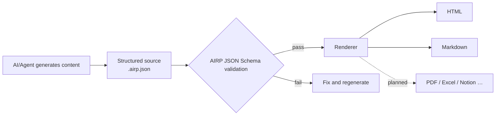

# AIRP — AI Report Protocol

[🇺🇸 English](./README.md) | [🇨🇳 中文](./README.cn.md) | [🇯🇵 日本語](./README.ja.md) | [🇰🇷 한국어](./README.ko.md) | [🇩🇪 Deutsch](./README.de.md) | [🇫🇷 Français](./README.fr.md) | [🇷🇺 Русский](./README.ru.md) | [🇪🇸 Español](./README.es.md) | [🇧🇷 Português (Brasil)](./README.pt-BR.md) | [🇮🇹 Italiano](./README.it.md)


**Turn AI/Agent conversation output into structured reports that are validatable, renderable, and maintainable over time.**

When writing proposals, retrospectives, or audit materials in Cursor, Copilot, Claude Code, and similar environments, chat logs are often hard to deliver as-is: layout is unstable, search is difficult, and re-exporting in another language or format is painful. AIRP uses a unified **JSON Schema** to constrain report structure (similar to Notion's multiple **Block** content types), first producing a structured source file **`.airp.json`**, then exporting **HTML** (reading/presentation) or **Markdown** (documentation workflows / further editing) through a **renderer**.

Repository: `https://github.com/maosong-ai/airp`

## Who it's for

| Role | Typical reports |
|---|---|
| Project manager / Product | Project briefs, milestone retrospectives, risks and action items |
| Operations / Business | Campaign summaries, benchmark analysis, decisions and follow-ups |
| Internal audit / QA | Severity tiers, evidence chains, remediation and verification checklists |
| Engineering / Architecture | Migration plans, technical reviews, testing and change notes |

## Core capabilities

| Capability | Description |
|---|---|
| **Structured source files** | `.airp.json` organizes content per Schema; auto-validated after generation to reduce "looks complete but missing sections" |
| **Content vs. presentation separation** | Maintain only the source file; HTML / Markdown exported by the renderer—change layout without rewriting content |
| **Multilingual (i18n)** | One source file can carry copy in multiple languages (`i18n.locales`); choose language on export or browse; UI supports Chinese, English, Japanese, Korean, German, French, Russian, Spanish, Portuguese, Italian, and more |
| **Themes and layout** | HTML export supports light/dark themes and other appearance options **without changing content** |
| **Extensible** | Future support for PDF, Excel, Notion, and other export targets |

## Quick start

**1. Install the Skill**

```bash
npx skills add maosong-ai/airp
```

**2. Commands and outputs**

| Command | Output | Purpose |
|---|---|---|
| `/airp` | `*.airp.json` | Generate and validate structured source (archive, search, post-process, re-export) |
| `/airp-dashboard` | Local Dashboard | Preview source files in the browser; also export HTML / Markdown online |
| `/airp-html` | `*.html` | Render existing source to a single-file webpage for sharing and presentation |
| `/airp-markdown` | `*.md` | Export Markdown for a chosen locale—Yuque, Feishu, GitHub, etc. |

**3. Recommended workflow**

```
/airp  →  source file  →  /airp-html      →  HTML      # external reading, presentation
/airp  →  source file  →  /airp-markdown  →  Markdown  # docs, further editing
```

**4. Output directory**

Default: `.docs/airp/` inside the project; use `--out <dir>` to override.

## Workflow



## Why "source file + renderer"

AIRP's **JSON Schema** (`airp-document.schema.json`) is the **single source of truth (SSOT)** for generation and validation:

- **Validatable**: fields and sections are constrained; validation failure means incomplete—no false deliverables.
- **Reusable**: source files suit version diff, search, and automation; HTML / Markdown are for human reading.
- **More stable and token-efficient for AI**: clear Block boundaries; long reports are less likely to drift than free-form HTML, and usually more compact at the same information density.
- **Multi-format without duplicate work**: update the source once, export web or docs on demand.

Report body is assembled from multiple **Blocks** (e.g. `section`, `table`, `risk`, `mermaid`, etc.). See the Schema for the full type list; in practice, describe the report type (e.g. "audit report", "project retrospective") and `/airp` picks suitable blocks automatically.

### Content modules (by purpose)

| Category | Typical Blocks |
|---|---|
| Opening and summary | `hero`, `lead`, `pullQuote` |
| Body and layout | `section`, `paragraph`, `table`, `callout`, various lists |
| Flow and diagrams | `flowSteps`, `mermaid`, `timeline`, `roadmap` |
| Decisions and risks | `comparison`, `decision`, `risk`, `assumption`, `openQuestion` |
| Execution and verification | `checklist`, `statusBoard`, `testResult`, `requirementTrace` |
| Appendix and references | `collapsible`, `tabs`, `appendix`, `glossary`, `citation` |

## FAQ

### Which file should I keep?

| Goal | Recommendation |
|---|---|
| Team archive, machine processing, re-export | `.airp.json` (source) |
| Email/IM sharing, presentation reading | `.html` |
| Docs editing, Markdown toolchain | `.md` (`/airp-markdown` + locale) |

### How does multilingual work?

- Specify languages in the prompt (e.g. "/airp <prompt> generate Chinese, Japanese, and English") → source includes all three locales.
- If unspecified (e.g. "/airp <prompt>") → Skill generates a single-locale source in the **current conversation language**.

### AIRP vs HTML vs Markdown

These are not mutually exclusive: **HTML / Markdown are export formats for reading.**

| Aspect | AIRP (`.airp.json`) | AI-written HTML | AI-written Markdown |
|---|---|---|---|
| **Role** | Structured source + Schema validation | Finished presentation page | Finished document |
| **Structure** | Blocks + Schema, validated after generation | Prompt-dependent; long pages miss blocks, layout drifts | Writing-habit dependent; long docs lose hierarchy |
| **Multilingual** | Multi-locale copy structure | Often separate full pages or manual copy | Often multiple `.md` files |
| **Multi-format export** | Same source → HTML / Markdown (and future PDF/Excel, etc.) | Markdown conversion needs rewrite or lossy transform | HTML needs rewrite or extra styling |
| **Human reading** | Render via `/airp-html` or `/airp-markdown` | Open single file, full layout | Platform renders; strong plain-text feel |
| **Re-editing** | AI edits source directly; or export Markdown for partial edits | HTML edits are costly | Most natural in doc tools |
| **Archive / search / diff** | Structured, stable fields | Tags and styles mixed, semantics hard to extract | Text-friendly, fields not unified |
| **AI multi-round edits** | Edit Block fields, clear boundaries | Many tags, long files, easy to miss edits | Medium; structure maintained by discipline |
| **Token / context** | Modular JSON, less redundancy | Same content, larger footprint | Medium |
| **Layout and theme** | Renderer layer switches; source unchanged | Styles embedded in file | Depends on target platform |
| **Best for** | Formal reports, multilingual, iterative teams, unified templates | One-off single pages, strong presentation | Short notes, final Markdown deliverable |
| **Less suited for** | Two-sentence notes, no archive needed | Strong validation, multilingual, multi-format pipeline | Strong Schema, one-click multilingual export |

> **Bottom line**: Use AIRP when you need consistency, inspectable structure, and one content source with many exports; use HTML or Markdown directly when the final format is fixed and you only need one version.

## Roadmap

- Encryption for source files and exports
- Multi-sheet page export
- PDF, Excel, Notion, and other renderers

---

## License

MIT
