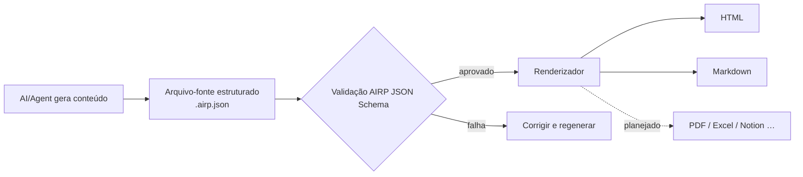

# AIRP — AI Report Protocol（Protocolo de Relatórios com IA）

[🇺🇸 English](./README.md) | [🇨🇳 中文](./README.cn.md) | [🇯🇵 日本語](./README.ja.md) | [🇰🇷 한국어](./README.ko.md) | [🇩🇪 Deutsch](./README.de.md) | [🇫🇷 Français](./README.fr.md) | [🇷🇺 Русский](./README.ru.md) | [🇪🇸 Español](./README.es.md) | [🇧🇷 Português (Brasil)](./README.pt-BR.md) | [🇮🇹 Italiano](./README.it.md)


**Transforme a saída de conversas de IA/Agent em relatórios estruturados, validáveis e fáceis de manter a longo prazo.**

Ao redigir planos, retrospectivas ou materiais de auditoria em ambientes como Cursor, Copilot ou Claude Code, o histórico de chat raramente serve como entrega direta: a formatação é instável, a busca é difícil e trocar de idioma ou formato para reenviar é trabalhoso. O AIRP usa um **JSON Schema** unificado para definir a estrutura do relatório (semelhante a vários **Block**s de conteúdo no estilo Notion), produz primeiro o arquivo-fonte estruturado **`.airp.json`** e, em seguida, exporta via **renderizador** para **HTML** (leitura/apresentação) ou **Markdown** (fluxo documental/edição posterior).

Repositório: `https://github.com/maosong-ai/airp`

## Para quem é

| Papel | Relatórios típicos |
|---|---|
| Gerente de projetos / Produto | Proposta de projeto, retrospectiva de marcos, riscos e pendências |
| Operações / Comercial | Resumo de campanhas, análise comparativa, decisões e itens de acompanhamento |
| Auditoria interna / Controle de qualidade | Classificação de problemas, cadeia de evidências, plano de correção e checklist de verificação |
| Desenvolvimento / Arquitetura | Plano de migração, revisão técnica, testes e notas de mudança |

## Visão geral das capacidades

| Capacidade | Descrição |
|---|---|
| **Arquivo-fonte estruturado** | `.airp.json` organiza o conteúdo conforme o Schema; validação automática após a geração, reduzindo casos de «parece completo, mas falta seção» |
| **Separação de conteúdo e apresentação** | O corpo do texto vive só no arquivo-fonte; HTML / Markdown são exportados pelo renderizador — trocar o layout sem reescrever o conteúdo |
| **Multilíngue (i18n)** | Um mesmo arquivo-fonte pode carregar textos em vários idiomas (`i18n.locales`); escolha o idioma na exportação ou na visualização; interface em chinês, inglês, japonês, coreano, alemão, francês, russo, espanhol, português, italiano etc. |
| **Tema e layout** | A exportação HTML permite alternar tema claro/escuro e outras aparências **sem alterar o corpo do texto** |
| **Extensível** | Futuras integrações com PDF, Excel, Notion e outros formatos de exportação |

## Início rápido

**1. Instalar o Skill**

```bash
npx skills add maosong-ai/airp
```

**2. Comandos e artefatos**

| Comando | Artefato | Uso |
|---|---|---|
| `/airp` | `*.airp.json` | Gera e valida o arquivo-fonte estruturado (arquivo, busca, reprocessamento, reexportação) |
| `/airp-dashboard` | Dashboard local | Pré-visualiza o arquivo-fonte no navegador; também exporta HTML / Markdown etc. online |
| `/airp-html` | `*.html` | Renderiza um arquivo-fonte existente como página web monolítica, ideal para compartilhar e apresentar |
| `/airp-markdown` | `*.md` | Exporta Markdown no idioma (locale) especificado, compatível com Yuque/Feishu/GitHub etc. |

**3. Fluxo recomendado**

```
/airp  →  arquivo-fonte  →  /airp-html      →  HTML      # leitura externa, apresentação
/airp  →  arquivo-fonte  →  /airp-markdown  →  Markdown  # base documental, edição contínua
```

**4. Diretório de saída**

Padrão: `.docs/airp/` dentro do projeto; use `--out <dir>` para definir outro caminho.

## Fluxo de trabalho



## Por que «arquivo-fonte + renderização»

O **JSON Schema** do AIRP (`airp-document.schema.json`) é a **fonte única da verdade (SSOT)** para geração e validação:

- **Validável**: campos e seções têm restrições; falha na validação significa entrega incompleta, evitando pseudoentregas.
- **Reutilizável**: o arquivo-fonte serve para diff de versões, busca e automação; HTML / Markdown são para leitura humana.
- **Mais estável e econômico em contexto para IA**: limites claros na estrutura de Block; relatórios longos desviam menos do que HTML livre, e o mesmo volume de informação costuma ser mais compacto que HTML verboso.
- **Vários formatos sem retrabalho**: altere o arquivo-fonte uma vez e exporte página ou documento conforme a necessidade.

O corpo do relatório é montado com vários **Block**s (por exemplo, seção `section`, tabela `table`, risco `risk`, diagrama `mermaid` etc.). A lista completa de tipos está no Schema; no dia a dia, basta indicar o tipo de relatório (como «relatório de auditoria» ou «retrospectiva de projeto») e o `/airp` escolhe automaticamente a combinação adequada de blocos.

### Módulos de conteúdo (por finalidade)

| Categoria | Block típicos |
|---|---|
| Abertura e resumo | `hero`, `lead`, `pullQuote` |
| Corpo e layout | `section`, `paragraph`, `table`, `callout`, vários tipos de lista |
| Fluxos e diagramas | `flowSteps`, `mermaid`, `timeline`, `roadmap` |
| Decisões e riscos | `comparison`, `decision`, `risk`, `assumption`, `openQuestion` |
| Execução e verificação | `checklist`, `statusBoard`, `testResult`, `requirementTrace` |
| Apêndices e referências | `collapsible`, `tabs`, `appendix`, `glossary`, `citation` |

## Perguntas frequentes

### Qual arquivo devo guardar?

| Objetivo | Recomendação |
|---|---|
| Arquivo da equipe, processamento automatizado, reexportação futura | `.airp.json` (arquivo-fonte) |
| Compartilhar por e-mail/IM, leitura em apresentação | `.html` |
| Edição em base documental, integração com ferramentas Markdown | `.md` (`/airp-markdown` + locale) |

### Como usar multilíngue?

- Indique os idiomas desejados no prompt (ex.: «/airp <prompt> gerar chinês, japonês e inglês») → o arquivo-fonte inclui textos nos três idiomas.
- Sem especificação (ex.: «/airp <prompt>») → o Skill gera um arquivo-fonte monolíngue conforme o **idioma da conversa atual**.

### AIRP vs HTML vs Markdown

Não são mutuamente exclusivos: **HTML / Markdown são formatos de exportação voltados à leitura.**

| Critério | AIRP (`.airp.json`) | Pedir HTML direto à IA | Pedir Markdown direto à IA |
|---|---|---|---|
| **Papel** | Arquivo-fonte estruturado + validação Schema | Página de apresentação pronta | Documento pronto |
| **Restrição estrutural** | Block + Schema, validável após geração | Depende do prompt; páginas longas perdem blocos, layout deriva | Depende do estilo de escrita; hierarquia inconsistente em textos longos |
| **Multilíngue** | Estrutura de textos multilíngues | Costuma exigir outra página inteira ou cópia manual | Costuma exigir vários `.md` |
| **Exportação multiformato** | Mesmo arquivo-fonte → HTML / Markdown (e futuramente PDF/Excel etc.) | Converter para Markdown exige reescrita ou perda | Converter para HTML exige reescrita ou estilos extras |
| **Leitura humana** | Renderize com `/airp-html` ou `/airp-markdown` | Abrir o arquivo e ver, layout completo | Renderização na plataforma, sensação de texto puro |
| **Edição posterior** | IA altera o arquivo-fonte diretamente; ou exporte Markdown para editar em partes | Editar HTML é caro | Mais natural em ferramentas documentais |
| **Arquivo / busca / diff** | Estruturado, campos estáveis | Tags e estilos misturados, semântica difícil de extrair | Amigável ao texto, campos não padronizados |
| **Revisões multirrodada com IA** | Alterar campos de Block, limites claros | Muitas tags, arquivo longo, fácil esquecer trechos | Moderado; estrutura depende de disciplina |
| **Token / contexto** | JSON modular, pouca redundância | Mesmo conteúdo ocupa mais volume | Moderado |
| **Layout e tema** | Camada de renderização alterna, arquivo-fonte intacto | Estilos embutidos no arquivo | Depende da plataforma de destino |
| **Melhor para** | Relatórios formais, multilíngue, iteração multirrodada, templates unificados da equipe | Página única pontual, apresentação forte | Textos curtos, notas, versão final já em Markdown |
| **Menos indicado para** | Duas ou três frases, sem necessidade de arquivo | Validação forte, multilíngue, pipeline multiformato | Schema rigoroso, exportação multilíngue com um clique |

> **Conclusão**: use AIRP quando precisar de «consistência + estrutura verificável + um conteúdo, várias exportações»; se o formato final já estiver definido e for só uma versão, HTML ou Markdown direto bastam.

## Próximos passos

- Criptografia de arquivo-fonte e artefatos exportados
- Exportação com várias abas (Sheets)
- Renderizadores para PDF, Excel, Notion etc.

---

## Licença

MIT
