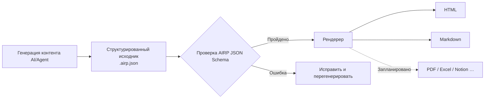

# AIRP — AI Report Protocol（протокол AI-отчётов）

[🇺🇸 English](./README.md) | [🇨🇳 中文](./README.cn.md) | [🇯🇵 日本語](./README.ja.md) | [🇰🇷 한국어](./README.ko.md) | [🇩🇪 Deutsch](./README.de.md) | [🇫🇷 Français](./README.fr.md) | [🇷🇺 Русский](./README.ru.md) | [🇪🇸 Español](./README.es.md) | [🇧🇷 Português (Brasil)](./README.pt-BR.md) | [🇮🇹 Italiano](./README.it.md)


**Превращайте вывод диалогов AI/Agent в структурированные отчёты, которые можно проверять, рендерить и поддерживать в долгосрочной перспективе.**

При подготовке предложений, ретроспектив или аудиторских материалов в Cursor, Copilot, Claude Code и подобных средах историю чата часто нельзя сразу передать заказчику: вёрстка нестабильна, поиск затруднён, а повторная выгрузка на другом языке или в другом формате — трудоёмка. AIRP использует единый **JSON Schema** для ограничения структуры отчёта (аналогично модели контента из нескольких **Block**, как в Notion): сначала создаётся структурированный исходный файл **`.airp.json`**, затем через **рендерер** экспортируются **HTML** (чтение/презентация) или **Markdown** (документооборот / дальнейшее редактирование).

Репозиторий: `https://github.com/maosong-ai/airp`

## Для кого

| Роль | Типичные отчёты |
|---|---|
| Менеджер проекта / продукт | Описание инициативы, ретроспектива по вехам, риски и задачи |
| Операции / бизнес | Итоги кампаний, сравнительный анализ, решения и пункты для отслеживания |
| Внутренний аудит / контроль качества | Классификация проблем, цепочки доказательств, списки исправлений и проверок |
| Разработка / архитектура | Планы миграции, технические ревью, описания тестов и изменений |

## Основные возможности

| Возможность | Описание |
|---|---|
| **Структурированный исходник** | `.airp.json` организует контент по Schema; после генерации выполняется автоматическая проверка, что снижает риск «выглядит полным, но разделы отсутствуют» |
| **Разделение контента и представления** | Основной текст хранится только в исходнике; HTML / Markdown экспортирует рендерер — смена оформления не требует переписывания текста |
| **Мультиязычность (i18n)** | Один исходник может содержать тексты на нескольких языках (`i18n.locales`); язык выбирается при экспорте или просмотре; интерфейс поддерживает китайский, английский, японский, корейский, немецкий, французский, русский, испанский, португальский, итальянский и др. |
| **Темы и оформление** | При экспорте HTML можно переключать светлую/тёмную тему и другие параметры **без изменения основного текста** |
| **Расширяемость** | В перспективе — экспорт в PDF, Excel, Notion и другие форматы |

## Быстрый старт

**1. Установка Skill**

```bash
npx skills add maosong-ai/airp
```

**2. Команды и артефакты**

| Команда | Артефакт | Назначение |
|---|---|---|
| `/airp` | `*.airp.json` | Генерация и проверка структурированного исходника (архив, поиск, доработка, повторный экспорт) |
| `/airp-dashboard` | Локальный Dashboard | Предпросмотр исходника в браузере; также онлайн-экспорт HTML / Markdown и др. |
| `/airp-html` | `*.html` | Рендеринг существующего исходника в одностраничный HTML для обмена и презентаций |
| `/airp-markdown` | `*.md` | Экспорт Markdown на указанном языке (locale) — для Yuque/Feishu/GitHub и т. п. |

**3. Рекомендуемый pipeline**

```
/airp  →  исходник  →  /airp-html      →  HTML      # внешнее чтение, презентация
/airp  →  исходник  →  /airp-markdown  →  Markdown  # база документов, дальнейшее редактирование
```

**4. Каталог вывода**

По умолчанию: `.docs/airp/` внутри проекта; путь можно задать через `--out <dir>`.

## Рабочий процесс



## Зачем нужны «исходник + рендеринг»

**JSON Schema** AIRP (`airp-document.schema.json`) — **единственный источник истины (SSOT)** для генерации и проверки:

- **Проверяемость**: поля и разделы ограничены; ошибка проверки означает, что отчёт не завершён — исключается «псевдо-готовность».
- **Повторное использование**: исходник удобен для сравнения версий, поиска и автоматизации; HTML / Markdown — для человека.
- **Стабильнее и экономнее по контексту для AI**: границы **Block**-структуры чёткие; длинные отчёты реже «уходят в сторону», чем при свободном HTML; при том же объёме информации обычно компактнее, чем развёрнутый HTML.
- **Несколько форматов без дублирования работы**: правите исходник один раз — экспортируете веб-страницу или документ по необходимости.

Текст отчёта собирается из различных **Block** (например, раздел `section`, таблица `table`, риск `risk`, диаграмма `mermaid` и т. д.). Полный список типов — в Schema; в повседневной работе достаточно указать тип отчёта (например, «аудиторский отчёт», «ретроспектива проекта») — `/airp` подберёт подходящий набор блоков.

### Модули контента (по назначению)

| Категория | Типичные Block |
|---|---|
| Вступление и резюме | `hero`, `lead`, `pullQuote` |
| Основной текст и вёрстка | `section`, `paragraph`, `table`, `callout`, различные списки |
| Процессы и схемы | `flowSteps`, `mermaid`, `timeline`, `roadmap` |
| Решения и риски | `comparison`, `decision`, `risk`, `assumption`, `openQuestion` |
| Исполнение и проверка | `checklist`, `statusBoard`, `testResult`, `requirementTrace` |
| Приложения и справочники | `collapsible`, `tabs`, `appendix`, `glossary`, `citation` |

## Частые вопросы

### Какой файл сохранять?

| Цель | Рекомендация |
|---|---|
| Архив команды, машинная обработка, повторный экспорт | `.airp.json` (исходник) |
| Обмен по email/IM, презентационное чтение | `.html` |
| Редактирование в базе документов, интеграция с Markdown-инструментами | `.md` (`/airp-markdown` + locale) |

### Как использовать мультиязычность?

- Укажите в запросе нужные языки (например, «/airp <запрос> — отчёт на китайском, японском и английском») → исходник содержит тексты на трёх языках.  
- Если язык не указан (например, «/airp <запрос>») → Skill создаёт одноязычный исходник на **языке текущего диалога**.

### AIRP vs HTML vs Markdown

Это не взаимоисключающие варианты: **HTML / Markdown — форматы экспорта для чтения.**

| Критерий | AIRP (`.airp.json`) | Прямая генерация HTML через AI | Прямая генерация Markdown через AI |
|---|---|---|---|
| **Роль** | Структурированный исходник + проверка по Schema | Готовая страница для показа | Готовый документ |
| **Структурные ограничения** | Block + Schema, проверка после генерации | Зависит от prompt; длинные страницы — пропуски блоков, дрейф вёрстки | Зависит от стиля; в длинных текстах иерархия часто неоднородна |
| **Мультиязычность** | Структура мультиязычных текстов | Часто нужны отдельные страницы или ручное копирование | Часто несколько файлов `.md` |
| **Экспорт в несколько форматов** | Один исходник → HTML / Markdown (и позже PDF/Excel и др.) | Конвертация в Markdown — переписывание или потери | Конвертация в HTML — переписывание или добавление стилей |
| **Чтение человеком** | Рендер через `/airp-html` или `/airp-markdown` | Один файл — сразу просмотр, полная вёрстка | Рендер на платформе, сильный «текстовый» вид |
| **Повторное редактирование** | AI правит исходник напрямую; можно экспортировать Markdown и править локально | Правка HTML дорога | Наиболее естественно в инструментах для документов |
| **Архив / поиск / diff** | Структурированно, поля стабильны | Теги и стили смешаны, семантику сложно извлечь | Удобен текст, поля не унифицированы |
| **Многораундовые правки AI** | Правка полей Block, границы чёткие | Много тегов, длинный файл — легко что-то пропустить | Средне; структура на совести автора |
| **Token / контекст** | Модульный JSON, мало избыточности | Тот же объём — больший размер, выше расход | Средне |
| **Оформление и темы** | Переключение на уровне рендерера, исходник не меняется | Стили встроены в файл | Зависит от целевой платформы |
| **Лучше подходит для** | Официальные отчёты, мультиязычность, итерации, единые шаблоны команды | Разовая страница, сильный визуальный акцент | Короткие тексты, заметки, финал сразу в Markdown |
| **Менее подходит для** | Две-три фразы без необходимости архива | Строгая проверка, мультиязычность, pipeline нескольких форматов | Строгий Schema, экспорт на несколько языков одной командой |

> **Вывод**: используйте AIRP, когда нужны «согласованность + проверяемая структура + один контент — несколько форматов экспорта»; если финальный формат уже определён и нужна только одна версия — достаточно HTML или Markdown.

## Планы развития

- Шифрование исходников и экспортов
- Экспорт с несколькими листами (Sheet)
- Рендереры PDF, Excel, Notion и др.

---

## Лицензия

MIT
